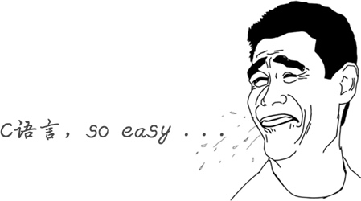

# C语言究竟是一门怎样的语言？

对于大部分程序员，C语言是学习编程的第一门语言，很少有不了解C的程序员。

C语言除了能让你了解编程的相关概念，带你走进编程的大门，还能让你明白程序的运行原理，比如，计算机的各个部件是如何交互的，程序在内存中是一种怎样的状态，操作系统和用户程序之间有着怎样的“爱恨情仇”，这些底层知识决定了你的发展高度，也决定了你的职业生涯。

如果你希望成为出类拔萃的人才，而不仅仅是码农，这么这些知识就是不可逾越的。也只有学习C语言，才能更好地了解它们。有了足够的基础，以后学习其他语言，会触类旁通，很快上手，7 天了解一门新语言不是神话。

C语言概念少，词汇少，包含了基本的编程元素，后来的很多语言（[C++](http://c.biancheng.net/cplus/)、[Java](http://c.biancheng.net/java/)等）都参考了C语言，说C语言是现代编程语言的开山鼻祖毫不夸张，它改变了编程世界。

正是由于C语言的简单，对初学者来说，学习成本小，时间短，结合本教程，能够快速掌握编程技术。

在世界编程语言排行榜中，C语言、Java 和 C++ 霸占了前三名，拥有绝对优势，如下表所示：

| 2015年01月榜单 |                                          |         |
| -------------- | ---------------------------------------- | ------- |
| 排名           | 语言                                     | 占有率  |
| 1              | C                                        | 16.703% |
| 2              | Java                                     | 15.528% |
| 3              | Objective-C                              | 6.953%  |
| 4              | C++                                      | 6.705%  |
| 5              | [C#](http://c.biancheng.net/csharp/)     | 5.045%  |
| 6              | [PHP](http://c.biancheng.net/php/)       | 3.784%  |
| 7              | [JavaScript](http://c.biancheng.net/js/) | 3.274%  |
| 8              | [Python](http://c.biancheng.net/python/) | 2.613%  |
| 9              | Perl                                     | 2.256%  |
| 10             | PL/SQL                                   | 2.014%  |
| 2015年06月榜单 |                                          |         |
| 排名           | 语言                                     | 占有率  |
| 1              | Java                                     | 17.822% |
| 2              | C                                        | 16.788% |
| 3              | C++                                      | 7.756%  |
| 4              | C#                                       | 5.056%  |
| 5              | Objective-C                              | 4.339%  |
| 6              | Python                                   | 3.999%  |
| 7              | Visual Basic .NET                        | 3.168%  |
| 8              | PHP                                      | 2.868%  |
| 9              | JavaScript                               | 2.295%  |
| 10             | Delphi/Object Pascal                     | 1.869%  |
| 2018年01月榜单 |                                          |         |
| 排名           | 语言                                     | 占有率  |
| 1              | Java                                     | 14.215% |
| 2              | C                                        | 11.037% |
| 3              | C++                                      | 5.603%  |
| 4              | Python                                   | 4.678%  |
| 5              | C#                                       | 3.754%  |
| 6              | JavaScript                               | 3.465%  |
| 7              | Visual Basic .NET                        | 3.261%  |
| 8              | R                                        | 2.549%  |
| 9              | PHP                                      | 2.532%  |
| 10             | Perl                                     | 2.419%  |

2017年，由于小型软件设备的蓬勃发展以及汽车行业底层软件的增加，C语言还拿下了「年度编程语言」的桂冠，成为 2017 年全球增长最快的编程语言。下表列出了最近 10 年的“年度编程语言”：

| 年份 | 优胜者                                        |
| ---- | --------------------------------------------- |
| 2017 | C            |
| 2016 | Go           |
| 2015 | Java         |
| 2014 | JavaScript   |
| 2013 | Transact-SQL |
| 2012 | Objective-C  |
| 2011 | Objective-C  |
| 2010 | Python       |
| 2009 | Go           |
| 2008 | C            |

C语言诞生于20世纪70年代，年龄比我们都要大，我们将在《[C语言的三套标准：C89、C99和C11](http://c.biancheng.net/view/vip_1742.html)》一节中讲解更多关于C语言的历史。

当然，C语言也不是没有缺点，毕竟是70后老人，有点落后时代，开发效率较低，后来人们又在C语言的基础上增加了面向对象的机制，形成了一门新的语言，称为C++，我们将在《[C语言和C++到底有什么关系](http://c.biancheng.net/view/vip_1722.html)》中讲解。

## C语言难吗？

和 Java、C++、Python、C#、JavaScript 等高级编程语言相比，C语言涉及到的编程概念少，附带的标准库小，所以整体比较简洁，容易学习，非常适合初学者入门。

编程语言的发展大概经历了以下几个阶段：

[汇编语言](http://c.biancheng.net/asm/) --> 面向过程编程 --> 面向对象编程

- 汇编语言是编程语言的拓荒年代，它非常底层，直接和计算机硬件打交道，开发效率低，学习成本高；
- C语言是面向过程的编程语言，已经脱离了计算机硬件，可以设计中等规模的程序了；
- Java、C++、Python、C#、PHP 等是面向对象的编程语言，它们在面向过程的基础上又增加了很多概念。

C语言出现的时候，已经度过了编程语言的拓荒年代，具备了现代编程语言的特性，但是这个时候还没有出现“[软件危机](https://baike.baidu.com/item/软件危机/564526)”，人们没有动力去开发更加高级的语言，所以也没有太复杂的编程思想。

也就是说，C语言虽然是现代编程语言，但是它涉及到的概念少，词汇少，思想也简单。C语言学习成本小，初学者能够在短时间内掌握编程技能，非常适合入门。

## C语言是计算机产业的核心语言

也许是机缘巧合，C语言出现后不久，计算机产业开始爆发，计算机硬件越来越小型化，越来越便宜，逐渐进入政府机构，进入普通家庭，C语言成了编程的主力军，获得了前所未有的成功，操作系统、常用软件、硬件驱动、底层组件、核心算法、数据库、小游戏等都使用C语言开发。

雷军说过，站在风口上，猪都能飞起来；C语言就是那头猪，不管它好不好，反正它飞起来了。

C语言在计算机产业大爆发阶段被万人膜拜，无疑会成为整个软件产业的基础，拥有核心地位。

软件行业的很多细分学科都是基于C语言的，学习[数据结构](http://c.biancheng.net/data_structure/)、算法、操作系统、编译原理等都离不开C语言，所以大学将C语言作为一门公共课程，计算机相关专业的同学都要学习。

C语言被誉为“上帝语言”，它不但奠定了软件产业的基础，还创造了很多其它语言，例如：

- PHP、Python 等都是用C语言开发出来的，虽然平时做项目的时候看不到C语言的影子，但是如果想深入学习 PHP 和 Python，那就要有C语言基础了。
- C++ 和 Objective-C 干脆在C语言的基础上直接进行扩展，增加一些新功能后变成了新的语言，所以学习 C++ 和 Objective-C 之前也要先学习C语言。

C语言是有史以来最为重要的编程语言：要进入编程行业高手级别必学C语言，要挣大钱必学C语言，要做黑客、红客必学C语言，要面试名企、外企、高薪职位必学C语言。

你也许会质疑，都 2021 年了，还有人在使用C语言这种古董吗？答案是肯定的，你可以猛击这里了解C语言在 2021 年的使用情况，以及C语言的多种实际用途。

**本文来自[C语言中文网站长](http://c.biancheng.net/view/8092.html)，只用于个人学习使用。**

