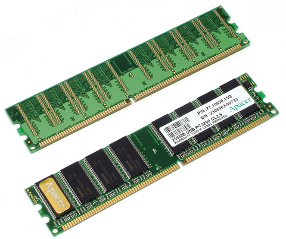

# C语言是菜鸟和大神的分水岭

作为一门古老的编程语言，C语言已经坚挺了好几十年了，初学者从C语言入门，大学将C语言视为基础课程。不管别人如何抨击，如何唱衰，C语言就是屹立不倒；[Java](http://c.biancheng.net/java/)、[C#](http://c.biancheng.net/csharp/)、[Python](http://c.biancheng.net/python/)、[PHP](http://c.biancheng.net/php/)、Perl 等都有替代方案，它们都可以倒下，唯独C语言不行。

程序是在内存中运行的（我们将在《[载入内存，让程序运行起来](http://c.biancheng.net/view/1727.html)》一节中详细说明），一名合格的程序员必须了解内存，学习C语言是了解内存布局的最简单、最直接、最有效的途径，C语言简直是为内存而生的，它比任何一门编程语言都贴近内存。

所谓内存，就是我们常说的内存条，就是下图这个玩意，相信你肯定见过。

图：内存条

所有的程序都在拼尽全力节省内存，都在不遗余力提高内存使用效率，计算机的整个发展过程都在围绕内存打转，不断地优化内存布局，以保证可以同时运行多个程序。

不了解内存，就学不会进程和线程，就没有资格玩中大型项目，没有资格开发底层组件，没有资格架构一个系统，命中注定你就是一个菜鸟，成不了什么气候。

以上这点我有深刻的体会！工作期间我曾专注于网站开发，虽然能够设计出界面漂亮、体验良好的网页，但是对内存泄漏、多线程、共享内存等底层概念一窍不通，感觉和周围同事的差距很大，这让我非常郁闷，不知道如何突破。我曾多次尝试学习内存和线程，也找了很多资料，但是无论如何都啃不懂，到头来还是一头雾水。

离职后我全职运营C语言中文网，于是决定再次系统、深入、全面地学习C语言，并结合C语言去了解一些内存知识，这个时候我才发现，原来C语言就是为内存而生的，C语言的设计和内存的布局是严密贴合的，我因为学习C语言而吃透了内存，了解了计算机内存是如何分布和组织的。

> C语言无时无刻不在谈内存，内存简直就是如影随形，你不得不去研究它。

至关重要的一点是，我能够把内存和具体的编程知识以及程序的运行过程结合起来，真正做到了学以致用，让概念落地，而不是空谈，这才是最难得的。

另外一个惊喜是，攻克内存后我竟然也能够理解进程和线程了，原来进程和线程也是围绕内存打转的，从一定程度上讲，它们的存在也是为了更加高效地利用内存。

从C语言到内存，从内存到进程和线程，环环相扣：不学C语言就吃不透内存，不学内存就吃不透进程和线程。

我感觉自己瞬间升华了，达到了一个新的高度，之前的很多谜团都解开了，和大神交流也没有障碍了。

「内存 + 进程 + 线程」这几个最基本的计算机概念是菜鸟和大神的分水岭，也只有学习C语言才能透彻地理解它们。Java、C#、PHP、Python、[JavaScript](http://c.biancheng.net/js/) 程序员工作几年后会遇到瓶颈，有很多人会回来学习C语言，重拾底层概念，让自己再次突破。
