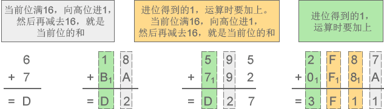

# 进制详解：二进制、八进制和十六进制

我们平时使用的数字都是由 0~9 共十个数字组成的，例如 1、9、10、297、952 等，一个数字最多能表示九，如果要表示十、十一、二十九、一百等，就需要多个数字组合起来。

例如表示 5+8 的结果，一个数字不够，只能”进位“，用 13 来表示；这时”进一位“相当于十，”进两位“相当于二十。

因为逢十进一（满十进一），也因为只有 0~9 共十个数字，所以叫做十进制（Decimalism）。十进制是在人类社会发展过程中自然形成的，它符合人们的思维习惯，例如人类有十根手指，也有十根脚趾。

进制也就是进位制。进行加法运算时逢X进一（满X进一），进行减法运算时借一当X，这就是X进制，这种进制也就包含X个数字，基数为X。十进制有 0~9 共10个数字，基数为10，在加减法运算中，逢十进一，借一当十。

## 二进制

我们不妨将思维拓展一下，既然可以用 0~9 共十个数字来表示数值，那么也可以用0、1两个数字来表示数值，这就是二进制（Binary）。例如，数字 0、1、10、111、100、1000001 都是有效的二进制。

在计算机内部，数据都是以二进制的形式存储的，二进制是学习编程必须掌握的基础。本节我们先讲解二进制的概念，下节讲解数据在内存中的存储，让大家学以致用。

二进制加减法和十进制加减法的思想是类似的：

- 对于十进制，进行加法运算时逢十进一，进行减法运算时借一当十；
- 对于二进制，进行加法运算时逢二进一，进行减法运算时借一当二。

下面两张示意图详细演示了二进制加减法的运算过程。

\1) 二进制加法：1+0=1、1+1=10、11+10=101、111+111=1110

图1：二进制加法示意图

\2) 二进制减法：1-0=1、10-1=1、101-11=10、1100-111=101

图2：二进制减法示意图

## 八进制

除了二进制，C语言还会使用到八进制。

八进制有 0~7 共8个数字，基数为8，加法运算时逢八进一，减法运算时借一当八。例如，数字 0、1、5、7、14、733、67001、25430 都是有效的八进制。

下面两张图详细演示了八进制加减法的运算过程。

\1) 八进制加法：3+4=7、5+6=13、75+42=137、2427+567=3216

图3：八进制加法示意图

\2) 八进制减法：6-4=2、52-27=23、307-141=146、7430-1451=5757

图4：八进制减法示意图

## 十六进制

除了二进制和八进制，十六进制也经常使用，甚至比八进制还要频繁。

十六进制中，用A来表示10，B表示11，C表示12，D表示13，E表示14，F表示15，因此有 0~F 共16个数字，基数为16，加法运算时逢16进1，减法运算时借1当16。例如，数字 0、1、6、9、A、D、F、419、EA32、80A3、BC00 都是有效的十六进制。

> 注意，十六进制中的字母不区分大小写，ABCDEF 也可以写作 abcdef。

下面两张图详细演示了十六进制加减法的运算过程。

\1) 十六进制加法：6+7=D、18+BA=D2、595+792=D27、2F87+F8A=3F11

图5：十六进制加法示意图

\2) 十六进制减法：D-3=A、52-2F=23、E07-141=CC6、7CA0-1CB1=5FEF

图6：十六进制减法示意图

