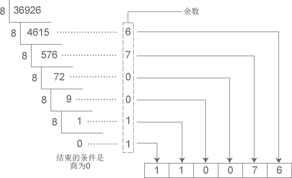
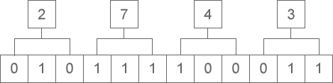
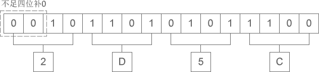

# 进制转换：二进制、八进制、十六进制、十进制之间的转换

> 对于基础薄弱的读者，本节的内容可能略显晦涩和枯燥，如果你觉得吃力，可以暂时跳过，基本不会影响后续章节的学习，等用到的时候再来阅读。

上节我们对二进制、八进制和十六进制进行了说明，本节重点讲解不同进制之间的转换，这在编程中经常会用到，尤其是C语言。

## 将二进制、八进制、十六进制转换为十进制

二进制、八进制和十六进制向十进制转换都非常容易，就是“按权相加”。所谓“权”，也即“位权”。

假设当前数字是 N 进制，那么：

- 对于整数部分，从右往左看，第 i 位的位权等于Ni-1
- 对于小数部分，恰好相反，要从左往右看，第 j 位的位权为N-j。

更加通俗的理解是，假设一个多位数（由多个数字组成的数）某位上的数字是 1，那么它所表示的数值大小就是该位的位权。

#### 1) 整数部分

例如，将八进制数字 53627 转换成十进制：

53627 = 5×8^4 + 3×8^3 + 6×8^2 + 2×8^1 + 7×8^0 = 22423（十进制）

从右往左看，第1位的位权为 8^0=1，第2位的位权为 8^1=8，第3位的位权为 8^2=64，第4位的位权为 8^3=512，第5位的位权为 8^4=4096 …… 第n位的位权就为 8^(n-1)。将各个位的数字乘以位权，然后再相加，就得到了十进制形式。

> 注意，这里我们需要以十进制形式来表示位权。

再如，将十六进制数字 9FA8C 转换成十进制：

9FA8C = 9×16^4 + 15×16^3 + 10×16^2 + 8×16^1 + 12×16^0 = 653964（十进制）

从右往左看，第1位的位权为 16^0=1，第2位的位权为 16^1=16，第3位的位权为 16^2=256，第4位的位权为 16^3=4096，第5位的位权为 16^4=65536 …… 第n位的位权就为 16^(n-1)。将各个位的数字乘以位权，然后再相加，就得到了十进制形式。

将二进制数字转换成十进制也是类似的道理：

11010 = 1×2^4 + 1×2^3 + 0×2^2 + 1×2^1 + 0×2^0 = 26（十进制）

从右往左看，第1位的位权为 2^0=1，第2位的位权为 2^1=2，第3位的位权为 2^2=4，第4位的位权为 2^3=8，第5位的位权为 2^4=16 …… 第n位的位权就为 2^(n-1)。将各个位的数字乘以位权，然后再相加，就得到了十进制形式。

#### 2) 小数部分

例如，将八进制数字 423.5176 转换成十进制：

423.5176 = 4×8^2 + 2×8^1 + 3×8^0 + 5×8^(-1) + 1×8^(-2) + 7×8^(-3) + 6×8^(-4) = 275.65576171875（十进制）

小数部分和整数部分相反，要从左往右看，第1位的位权为 8^(-1)=1/8，第2位的位权为 8^(-2)=1/64，第3位的位权为 8^(-3)=1/512，第4位的位权为 8^(-4)=1/4096 …… 第m位的位权就为 8^(-m)。

再如，将二进制数字 1010.1101 转换成十进制：

1010.1101 = 1×2^3 + 0×2^2 + 1×2^1 + 0×2^0 + 1×2^(-1) + 1×2^(-2) + 0×2^(-3) + 1×2^(-4) = 10.8125（十进制）

小数部分和整数部分相反，要从左往右看，第1位的位权为 2^(-1)=1/2，第2位的位权为 2^(-2)=1/4，第3位的位权为 2^(-3)=1/8，第4位的位权为 2^(-4)=1/16 …… 第m位的位权就为 2^(-m)。

更多转换成十进制的例子：

- 二进制：1001 = 1×2^3 + 0×2^2 + 0×2^1 + 1×2^0 = 8 + 0 + 0 + 1 = 9（十进制）
- 二进制：101.1001 = 1×2^2 + 0×2^1 + 1×2^0 + 1×2^(-1) + 0×2^(-2) + 0×2^(-3) + 1×2^(-4) = 4 + 0 + 1 + 0.5 + 0 + 0 + 0.0625 = 5.5625（十进制）
- 八进制：302 = 3×8^2 + 0×8^1 + 2×8^0 = 192 + 0 + 2 = 194（十进制）
- 八进制：302.46 = 3×8^2 + 0×8^1 + 2×8^0 + 4×8^(-1) + 6×8^(-2) = 192 + 0 + 2 + 0.5 + 0.09375= 194.59375（十进制）
- 十六进制：EA7 = 14×16^2 + 10×16^1 + 7×16^0 = 3751（十进制）

## 将十进制转换为二进制、八进制、十六进制

将十进制转换为其它进制时比较复杂，整数部分和小数部分的算法不一样，下面我们分别讲解。

#### 1) 整数部分

十进制整数转换为 N 进制整数采用“除 N 取余，逆序排列”法。具体做法是：

- 将 N 作为除数，用十进制整数除以 N，可以得到一个商和余数；
- 保留余数，用商继续除以 N，又得到一个新的商和余数；
- 仍然保留余数，用商继续除以 N，还会得到一个新的商和余数；
- ……
- 如此反复进行，每次都保留余数，用商接着除以 N，直到商为 0 时为止。

把先得到的余数作为 N 进制数的低位数字，后得到的余数作为 N 进制数的高位数字，依次排列起来，就得到了 N 进制数字。

下图演示了将十进制数字 36926 转换成八进制的过程：

从图中得知，十进制数字 36926 转换成八进制的结果为 110076。

下图演示了将十进制数字 42 转换成二进制的过程：

从图中得知，十进制数字 42 转换成二进制的结果为 101010。

#### 2) 小数部分

十进制小数转换成 N 进制小数采用“乘 N 取整，顺序排列”法。具体做法是：

- 用 N 乘以十进制小数，可以得到一个积，这个积包含了整数部分和小数部分；
- 将积的整数部分取出，再用 N 乘以余下的小数部分，又得到一个新的积；
- 再将积的整数部分取出，继续用 N 乘以余下的小数部分；
- ……
- 如此反复进行，每次都取出整数部分，用 N 接着乘以小数部分，直到积中的小数部分为 0，或者达到所要求的精度为止。

把取出的整数部分按顺序排列起来，先取出的整数作为 N 进制小数的高位数字，后取出的整数作为低位数字，这样就得到了 N 进制小数。

下图演示了将十进制小数 0.930908203125 转换成八进制小数的过程：

从图中得知，十进制小数 0.930908203125 转换成八进制小数的结果为 0.7345。

下图演示了将十进制小数 0.6875 转换成二进制小数的过程：

从图中得知，十进制小数 0.6875 转换成二进制小数的结果为 0.1011。

如果一个数字既包含了整数部分又包含了小数部分，那么将整数部分和小数部分开，分别按照上面的方法完成转换，然后再合并在一起即可。例如：

- 十进制数字 36926.930908203125 转换成八进制的结果为 110076.7345；
- 十进制数字 42.6875 转换成二进制的结果为 101010.1011。

下表列出了前 17 个十进制整数与二进制、八进制、十六进制的对应关系：

| 十进制   | 0    | 1    | 2    | 3    | 4    | 5    | 6    | 7    | 8    | 9    | 10   | 11   | 12   | 13   | 14   | 15   | 16    |
| -------- | ---- | ---- | ---- | ---- | ---- | ---- | ---- | ---- | ---- | ---- | ---- | ---- | ---- | ---- | ---- | ---- | ----- |
| 二进制   | 0    | 1    | 10   | 11   | 100  | 101  | 110  | 111  | 1000 | 1001 | 1010 | 1011 | 1100 | 1101 | 1110 | 1111 | 10000 |
| 八进制   | 0    | 1    | 2    | 3    | 4    | 5    | 6    | 7    | 10   | 11   | 12   | 13   | 14   | 15   | 16   | 17   | 20    |
| 十六进制 | 0    | 1    | 2    | 3    | 4    | 5    | 6    | 7    | 8    | 9    | A    | B    | C    | D    | E    | F    | 10    |

注意，十进制小数转换成其他进制小数时，结果有可能是一个无限位的小数。请看下面的例子：

- 十进制 0.51 对应的二进制为 0.100000101000111101011100001010001111010111...，是一个循环小数；
- 十进制 0.72 对应的二进制为 0.1011100001010001111010111000010100011110...，是一个循环小数；
- 十进制 0.625 对应的二进制为 0.101，是一个有限小数。

## 二进制和八进制、十六进制的转换

其实，任何进制之间的转换都可以使用上面讲到的方法，只不过有时比较麻烦，所以一般针对不同的进制采取不同的方法。将二进制转换为八进制和十六进制时就有非常简洁的方法，反之亦然。

#### 1) 二进制整数和八进制整数之间的转换

二进制整数转换为八进制整数时，每三位二进制数字转换为一位八进制数字，运算的顺序是从低位向高位依次进行，高位不足三位用零补齐。下图演示了如何将二进制整数 1110111100 转换为八进制：

从图中可以看出，二进制整数 1110111100 转换为八进制的结果为 1674。

八进制整数转换为二进制整数时，思路是相反的，每一位八进制数字转换为三位二进制数字，运算的顺序也是从低位向高位依次进行。下图演示了如何将八进制整数 2743 转换为二进制：

从图中可以看出，八进制整数 2743 转换为二进制的结果为 10111100011。

#### 2) 二进制整数和十六进制整数之间的转换

二进制整数转换为十六进制整数时，每四位二进制数字转换为一位十六进制数字，运算的顺序是从低位向高位依次进行，高位不足四位用零补齐。下图演示了如何将二进制整数 10 1101 0101 1100 转换为十六进制：

从图中可以看出，二进制整数 10 1101 0101 1100 转换为十六进制的结果为 2D5C。

十六进制整数转换为二进制整数时，思路是相反的，每一位十六进制数字转换为四位二进制数字，运算的顺序也是从低位向高位依次进行。下图演示了如何将十六进制整数 A5D6 转换为二进制：

从图中可以看出，十六进制整数 A5D6 转换为二进制的结果为 1010 0101 1101 0110。

在C语言编程中，二进制、八进制、十六进制之间几乎不会涉及小数的转换，所以这里我们只讲整数的转换，大家学以致用足以。另外，八进制和十六进制之间也极少直接转换，这里我们也不再讲解了。

## 总结

本节前面两部分讲到的转换方法是通用的，任何进制之间的转换都可以采用，只是有时比较麻烦而已。二进制和八进制、十六进制之间的转换有非常简洁的方法，所以没有采用前面的方法。

**本文来自[C语言中文网站长](http://c.biancheng.net/view/8092.html)，只用于个人学习使用。**