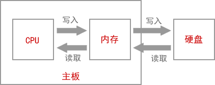

# 载入内存，让程序运行起来

如果你的电脑上安装了QQ，你希望和好友聊天，会双击QQ图标，打开QQ软件，输入账号和密码，然后登录就可以了。

那么，QQ是怎么运行起来的呢？

首先，有一点你要明确，你安装的QQ软件是保存在硬盘中的。

双击QQ图标，操作系统就会知道你要运行这个软件，它会在硬盘中找到你安装的QQ软件，将数据（安装的软件本质上就是很多数据的集合）复制到内存。对！就是复制到内存！QQ不是在硬盘中运行的，而是在内存中运行的。

为什么呢？因为内存的读写速度比硬盘快很多。

对于读写速度，内存 > 固态硬盘 > 机械硬盘。机械硬盘是靠电机带动盘片转动来读写数据的，而内存条通过电路来读写数据，电机的转速肯定没有电的传输速度（几乎是光速）快。虽然固态硬盘也是通过电路来读写数据，但是因为与内存的控制方式不一样，速度也不及内存。

所以，不管是运行QQ还是编辑Word文档，都是先将硬盘上的数据复制到内存，才能让CPU来处理，这个过程就叫作载入内存（Load into Memory）。完成这个过程需要一个特殊的程序（软件），这个程序就叫做加载器（Loader）。

CPU直接与内存打交道，它会读取内存中的数据进行处理，并将结果保存到内存。如果需要保存到硬盘，才会将内存中的数据复制到硬盘。

例如，打开Word文档，输入一些文字，虽然我们看到的不一样了，但是硬盘中的文档没有改变，新增的文字暂时保存到了内存，Ctrl+S才会保存到硬盘。因为内存断电后会丢失数据，所以如果你编辑完Word文档忘记保存就关机了，那么你将永远无法找回这些内容。

## 虚拟内存

如果我们运行的程序较多，占用的空间就会超过内存（内存条）容量。例如计算机的内存容量为2G，却运行着10个程序，这10个程序共占用3G的空间，也就意味着需要从硬盘复制 3G 的数据到内存，这显然是不可能的。

操作系统（Operating System，简称 OS）为我们解决了这个问题：当程序运行需要的空间大于内存容量时，会将内存中暂时不用的数据再写回硬盘；需要这些数据时再从硬盘中读取，并将另外一部分不用的数据写入硬盘。这样，硬盘中就会有一部分空间用来存放内存中暂时不用的数据。这一部分空间就叫做虚拟内存（Virtual Memory）。

3G - 2G = 1G，上面的情况需要在硬盘上分配 1G 的虚拟内存。

硬盘的读写速度比内存慢很多，反复交换数据会消耗很多时间，所以如果你的内存太小，会严重影响计算机的运行速度，甚至会出现”卡死“现象，即使CPU强劲，也不会有大的改观。如果经济条件允许，建议将内存升级为 4G，在 win7、win8、win10 下运行软件就会比较流畅了。

关于内存的更多知识，大家可以阅读《[C语言内存精讲](http://c.biancheng.net/c/140/)》，我敢保证你将会顿悟。

总结：CPU直接从内存中读取数据，处理完成后将结果再写入内存。

图1：CPU、内存、硬盘和主板的关系