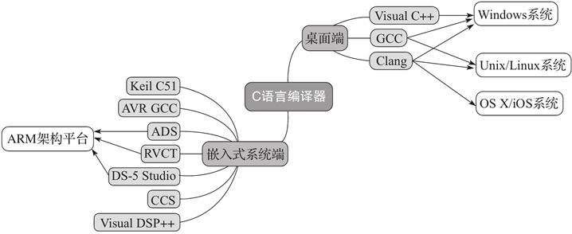

# C语言编译器（C语言编程软件）完全攻略（包含所有平台）

在上节《[C语言编译和链接](http://c.biancheng.net/view/144.html)》中我们已经讲解了C语言编译器的概念，由于C语言的历史比较久，而且早期没有规范，整个计算机产业也都处于拓荒的年代，所以就涌现了很多款C语言编译器，它们各有特点，适用于不同的平台，本节就来给大家科普一下。

我们分两部分介绍C语言的编译器，分别是桌面操作系统和嵌入式操作系统。

## 桌面操作系统

对于当前主流桌面操作系统而言，可使用 Visual [C++](http://c.biancheng.net/cplus/)、[GCC](http://c.biancheng.net/gcc/) 以及 LLVM Clang 这三大编译器。

Visual C++（简称 MSVC）是由微软开发的，只能用于 Windows 操作系统；GCC 和 LLVM Clang 除了可用于 Windows 操作系统之外，主要用于 Unix/Linux 操作系统。

像现在很多版本的 Linux 都默认使用 GCC 作为C语言编译器，而像 FreeBSD、macOS 等系统默认使用 LLVM Clang 编译器。由于当前 LLVM 项目主要在 Apple 的主推下发展的，所以在 macOS中，Clang 编译器又被称为 Apple LLVM 编译器。

MSVC 编译器主要用于 Windows 操作系统平台下的应用程序开发，它不开源。用户可以使用 Visual Studio Community 版本来免费使用它，但是如果要把通过 Visual Studio Community 工具生成出来的应用进行商用，那么就得好好阅读一下微软的许可证和说明书了。

而使用 GCC 与 Clang 编译器构建出来的应用一般没有任何限制，程序员可以将应用程序随意发布和进行商用。

MSVC 编译器对 C99 标准的支持就十分有限，加之它压根不支持任何 C11 标准，所以本教程中设计 C11 的代码例子不会针对 MSVC 进行描述。所幸的是，Visual Studio Community 2017 加入了对 Clang 编译器的支持，官方称之为——Clang with Microsoft CodeGen，当前版本基于的是 Clang 3.8。

也就是说，应用于 Visual Studio 集成开发环境中的 Clang 编译器前端可支持 Clang 编译器的所有语法特性，而后端生成的代码则与 MSVC 效果一样，包括像 long 整数类型在 64 位编译模式下长度仍然为 4 个字节，所以各位使用的时候也需要注意。

为了方便描述，本教程后面涉及 Visual Studio 集成开发环境下的 Clang 编译器简称为 VS-Clang 编译器。

## 嵌入式系统

而在嵌入式系统方面，可用的C语言编译器就非常丰富了，比如：

- 用于 Keil 公司 51 系列单片机的 Keil C51 编译器；
- 当前大红大紫的 Arduino 板搭载的开发套件，可用针对 AVR 微控制器的 AVR GCC 编译器；
- ARM 自己出的 ADS（ARM Development Suite）、RVDS（RealView Development Suite）和当前最新的 DS-5 Studio；
- DSP 设计商 TI（Texas Instruments）的 CCS（Code Composer Studio）；
- DSP 设计商 ADI（Analog Devices，Inc.）的 Visual DSP++ 编译器，等等。

通常，用于嵌入式系统开发的编译工具链都没有免费版本，而且一般需要通过国内代理进行购买。所以，这对于个人开发者或者嵌入式系统爱好者而言是一道不低的门槛。

不过 Arduino 的开发套件是可免费下载使用的，并且用它做开发板连接调试也十分简单。Arduino 所采用的C编译器是基于 GCC 的。

还有像树莓派（Raspberry Pi）这种迷你电脑可以直接使用 GCC 和 Clang 编译器。此外，还有像 nVidia 公司推出的 Jetson TK 系列开发板也可直接使用 GCC 和 Clang 编译器。树莓派与 Jetson TK 都默认安装了 Linux 操作系统。

在嵌入式领域，一般比较低端的单片机，比如 8 位的 MCU 所对应的C编译器可能只支持 C90 标准，有些甚至连 C90 标准的很多特性都不支持。因为它们一方面内存小，ROM 的容量也小；另一方面，本身处理器机能就十分有限，有些甚至无法支持函数[指针](http://c.biancheng.net/c/80/)，因为处理器本身不包含通过寄存器做间接过程调用的指令。

而像 32 位处理器或 DSP，一般都至少能支持 C99 标准，它们本身的性能也十分强大。而像 ARM 出的 RVDS 编译器甚至可用 GNU 语法扩展。

下图展示了上述C语言编译器的分类。

