# 制作安装包，让用户安装程序

经过多年的发展，Windows 安装包的制作技术已经非常成熟，有不少现成的工具，无需我们自己编写代码，例如 Inno Setup、NSIS、Advanced Installer、Setup Factory、Smart Install Maker、Nullsoft、InstallShield，Advanced Installer 等。

软件安装的过程大部分是文件拷贝的过程，如果不需要写入注册表，不需要向不同的目录拷贝 DLL，那么使用 WinRAR 也可以制作简单的安装包，大家可以自行谷歌或百度。这里我们教大家使用 VS2010 制作安装包。

启动VS2010，选择`文件 --> 新建 --> 项目`，或者使用`Ctrl+Shift+N`组合键，弹出如下对话框：

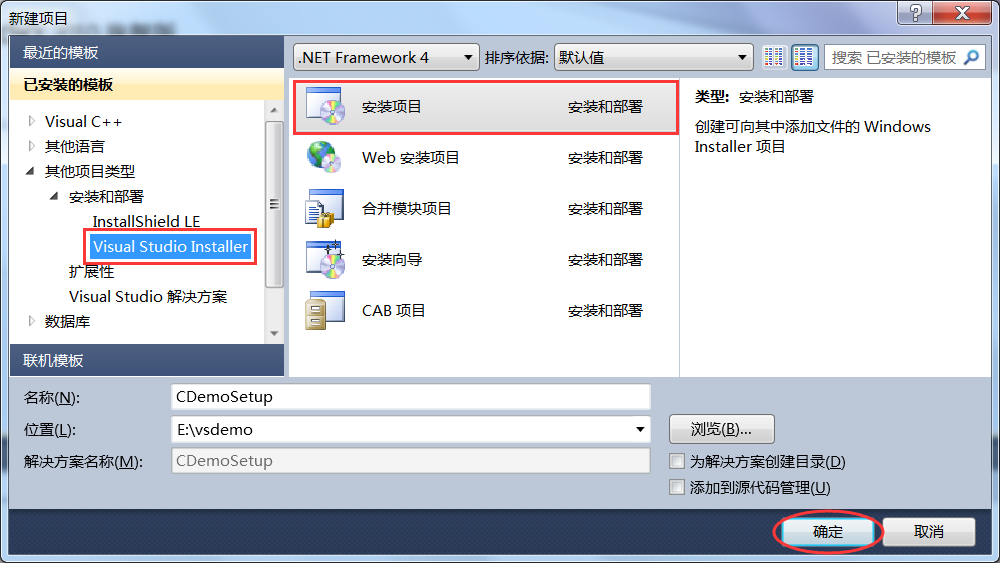
 

选择`Visual Studio Installer --> 安装项目`，并填写项目名称和保存位置，点击“确定”按钮，项目就创建好了，如下图所示：

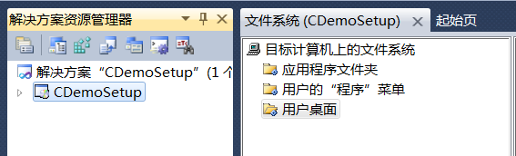

在`应用程序文件夹`处单击鼠标右键选择`添加 --> 文件夹`，如下图所示：

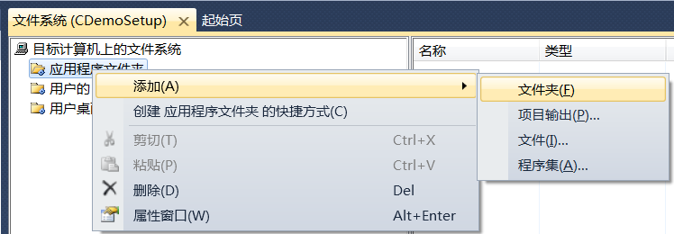

我们不妨将文件夹命名为 CDemo。这个文件夹就是程序安装后所在安装路径下生成的、包含程序相关组件的文件夹。例如，用户选择将程序安装到 D:\Program Files\ 目录，那么安装时会先在该目录创建一个名称为 CDemo 的新文件夹，再将程序的所有组件拷贝到 CDemo 中，最终程序的所有文件是在 D:\Program Files\CDemo\ 目录下。

接下来，向 CDemo 文件夹中添加程序要用到的所有文件，如下图所示：

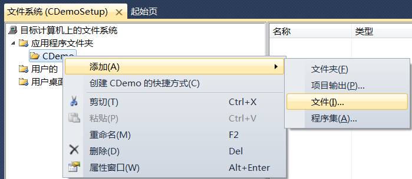

添加好以后如下图所示：

demo.exe 是我们编译好的可执行文件，demo.ico 和 uninstall.ico 是图标，用来创建快捷方式。程序图标必须是`.ico`格式，可以通过 jpg、png 等常见图片格式在线转换。文章最后会给出两个图标的下载地址。

> 制作安装包之前，可以将程序使用到的所有文件都拷贝到一个目录下，这样就可以一次性添加到 CDemo。

#### 实现卸载功能

如果要实现卸载功能的话，还需要将`C:\Windows\System32\msiexec.exe`也添加到 CDemo 中。

#### 添加快捷方式

快捷方式存在于两个地方，分别是桌面和开始菜单，`用户的“程序”菜单`用来存放开始菜单中的快捷方式，`用户桌面`用来存放桌面上的快捷方式。

在"demo.exe"上单击鼠标右键选择`创建demo.exe的快捷方式`，如下图所示：

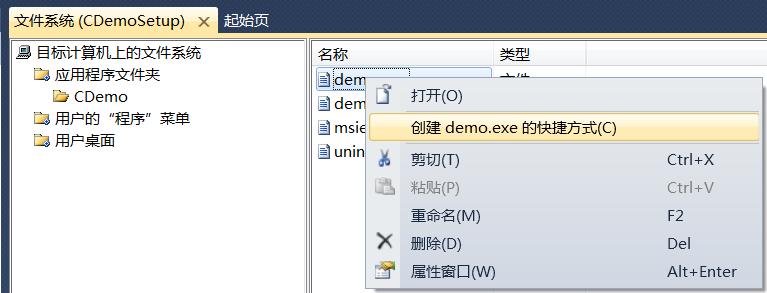

用鼠标单击生成的快捷方式，在右侧会弹出属性面板，如下图所示：

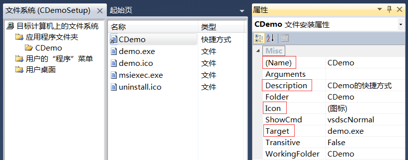

Name 表示快捷方式的名称，一般是程序名；Description 表示对快捷方式的说明，也就是鼠标悬浮时显示的文本；Target 表示快捷方式指向哪个可执行程序；Icon 表示图标，可以按照下图所示的方式添加：

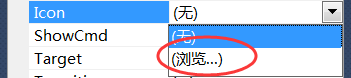

按照同样的方式为 msiexec.exe 也生成快捷方式，并将 Name 设置为“卸载CDemo”，将 Description 设置为“卸载CDemo程序”，将 Icon 设置为“uninstall.ico”。

在`用户的“程序”菜单`下新建文件夹 CDemo，将两个快捷方式剪切粘贴到该文件夹下。然后再为 demo.exe 创建快捷方式，并剪切粘贴到`用户桌面`下。

这样，程序安装后在桌面和开始菜单中都有快捷方式，都可以启动了。

#### 实现卸载功能

上面我们虽然添加了系统自带的卸载程序，并为卸载程序创建了快捷方式，但目前依然无法实现卸载功能，因为还不知道要卸载哪个程序。

在项目名称`CDemoSetup`上单击鼠标右键，会看到右侧出现一个属性面板，如下图所示：

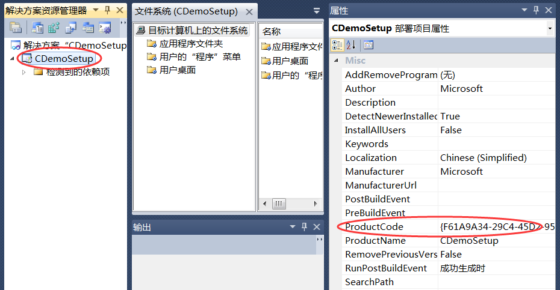

ProductCode 是产品代码，即产品ID，我们需要将它告诉卸载程序。每个程序的ID都不同，有了它，卸载程序才知道卸载哪一个软件。本例中，程序ID为`{F61A9A34-29C4-45D2-9555-1D4E1D256FDF}`。

在卸载程序 msiexec.exe 的快捷方式上单击鼠标右键，在右侧属性面板中，将 Arguments 的值设置为`/x{F61A9A34-29C4-45D2-9555-1D4E1D256FDF}`，如下图所示：

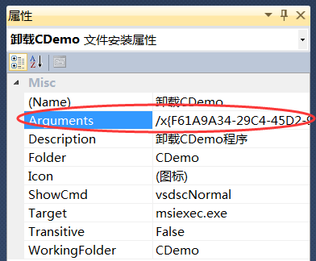

这样，卸载程序就知道卸载哪个软件了。

#### 选择系统必备

在项目名称 CDemoSetup 上点击鼠标右键，选择“属性”，弹出如下的对话框：

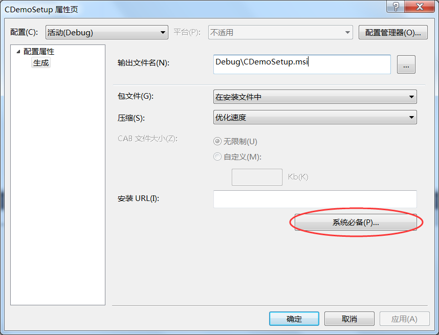

点击“系统必备”，弹出如下对话框：

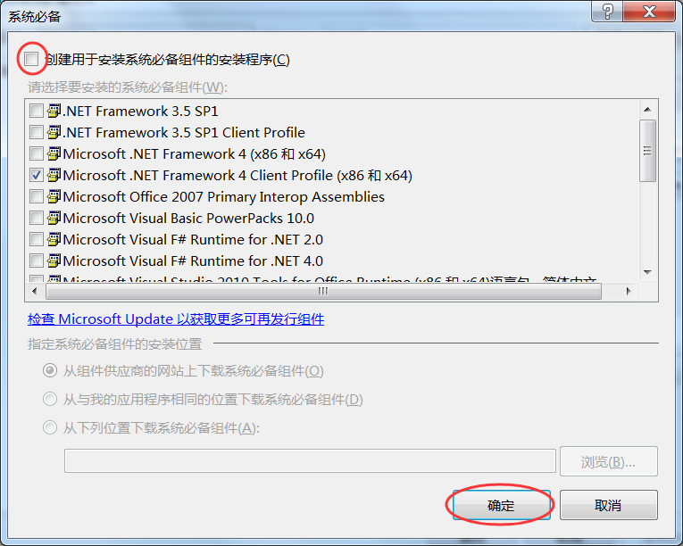

可以在这里选择程序需要的系统组件。我们的程序不需要任何组件，所以将`创建用于安装系统必备组件的安装程序`前面的对勾取消，然后点击“确定”按钮，就设置完成了。

至此，我们的安装包就编辑完成了，生成项目后，可以在Debug目录下看到 CDemoSetup.msi 文件，这就是我们制作好的安装包，双击运行，就可以安装我们的程序了。

安装完成后，就可以在开始菜单和桌面上看到快捷方式了，如下图所示：

 

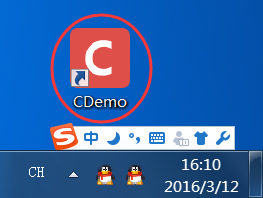

程序图标下载地址：http://pan.baidu.com/s/1pK0fwIR 提取密码：iux9