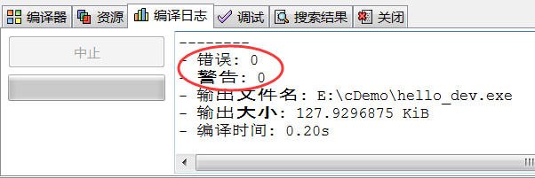
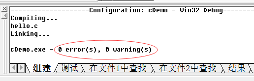
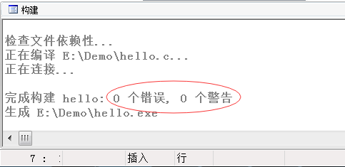
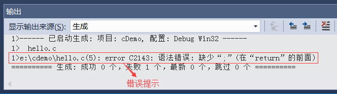
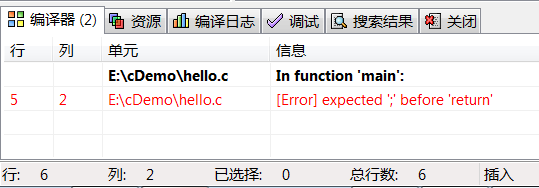
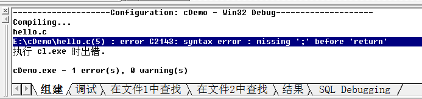
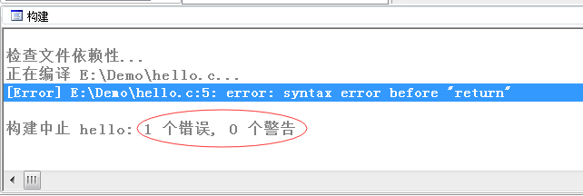
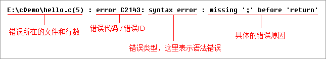

# C语言程序的错误和警告

一段C语言代码，在编译、链接和运行的各个阶段都可能会出现问题。编译器只能检查编译和链接阶段出现的问题，而可执行程序已经脱离了编译器，运行阶段出现问题编译器是无能为力的。

如果我们编写的代码正确，运行时会提示没有错误（Error）和警告（Warning），如下图所示：

图1：Dev [C++](http://c.biancheng.net/cplus/) 的提示

图2：VC 6.0 的提示

图3：C-Free 5.0 的提示

> 对于 VS、[GCC](http://c.biancheng.net/gcc/)、Xcode 等，如果代码没有错误，它们只会显示“生成成功”，不会显示“0个错误，0个警告”，只有代码真的出错了，它们才会显示具体的错误信息。

错误（Error）表示程序不正确，不能正常编译、链接或运行，必须要纠正。

警告（Warning）表示可能会发生错误（实际上未发生）或者代码不规范，但是程序能够正常运行，有的警告可以忽略，有的要引起注意。

错误和警告可能发生在编译、链接、运行的任何时候。

例如，`puts("C语言中文网")`最后忘记写分号`;`，就会出现错误，如下图所示：

图4：VS2015 的错误提示

图5：Dev C++ 的错误提示

图6：VC 6.0 的错误提示

图7：C-Free 5.0 的错误提示

可以看出，C-Free 的错误提示信息比较少，不方便程序员纠错。VC 和 VS 的错误信息类似，只是中英文的差别。

下图分析了 VC 6.0 的错误信息：

图8：错误信息说明

翻译：源文件 E:\cDemo\hello.c 第5行发生了语法错误，错误代码是 C2143，原因是 'return' 前面丢失了 ';'。

我敢保证，你写的代码肯定会发生错误，一定要有分析错误的能力，这是一个合格的程序员必备的技能。
