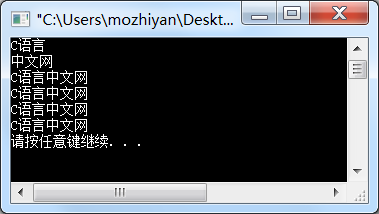

# C语言代码中的空白符

空格、制表符、换行符等统称为空白符（space character），它们只用来占位，并没有实际的内容，也显示不出具体的字符。

> 制表符分为水平制表符和垂直制表符，它们的 ASCII 编码值分别是 9 和 11。
>
> - 垂直制表符在现代计算机中基本不再使用了，也没法在键盘上直接输入，它已经被换行符取代了。
> - 水平制表符相当于四个空格，对于大部分编辑器，按下 Tab 键默认就是输入一个水平制表符；如果你进行了个性化设置，按下 Tab 键也可能会输入四个或者两个空格。

对于编译器，有的空白符会被忽略，有的却不能。请看下面几种 puts 的写法：

```
#include<stdio.h>
int main()
{
    puts("C语言");
    puts("中文网");
   
    puts
    ("C语言中文网");
   
    puts
    (
    "C语言中文网"
    )
    ;
   
    puts   ("C语言中文网");

    puts    (    "C语言中文网"    )    ;

    return 0;
}
```

运行结果：


看到输出结果，说明代码没有错误，以上几种 puts 的用法是正确的。`puts`和`()`之间、`" "`和`()`之间可以有任意的空白符，它们会被编译器忽略，编译器不认为它们是代码的一部分，它们的存在只是在编辑器中呈现一定的格式，让程序员阅读方便。

需要注意的是，由`" "`包围起来的字符串中的空白符不会被忽略，它们会被原样输出到控制台上；并且字符串中间不能换行，否则会产生编译错误。请看下面的代码：

```
#include<stdio.h>
int main()
{
    puts("C语  言 中文网");
    puts("C语言
    中文网");
    return 0;
}
```

第 5~6 行代码是错误的，字符串必须在一行内结束，不能换行。把这两行代码删除，运行结果为：


程序员要善于利用空白符：缩进（制表符）和换行可以让代码结构更加清晰，空格可以让代码看起来不那么拥挤。专业的程序员同样追求专业的代码格式，大家在以后的学习中可以慢慢体会。

