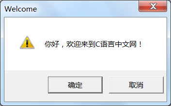
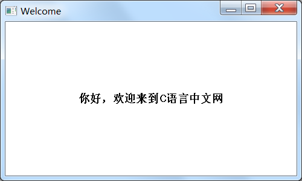

# 一个真正带界面的C语言程序

> 对于初学者来说，本节涉及到的代码比较复杂，名字也不容易记住，大家只需要把代码复制到编译器，看一下运行效果就可以。本节重在演示C语言能做什么，而不是教授大家知识点（这些知识点也不是C语言的重点），所以，不理解的就放过吧，不会影响后面的学习。

C语言不仅可以编写“黑屏”的控制台程序，还可以编写拥有漂亮界面的Windows程序（GUI程序），只是绝大多数C语言教程都没有告诉你而已，让你以为C语言程序只能是“黑乎乎”的。

开发 GUI 程序需要选择的项目类型是“Win32项目”，其他操作和控制台程序一样。


第一个带界面的C语言程序：

```c
#include <windows.h>

int WINAPI WinMain(
    HINSTANCE hInstance,
    HINSTANCE hPrevInstance,
    LPSTR lpCmdLine,
    int nCmdShow
){
    int nSelect = MessageBox(NULL, "你好，欢迎来到C语言中文网！", "Welcome", MB_OKCANCEL | MB_ICONEXCLAMATION);
    return 0;
}
```

运行结果：


你看，弹出一个带界面的欢迎窗口。控制台程序以`main`为入口函数，Windows程序以`WinMain`为入口函数，后续我会在《[Windows入门教程](http://c.biancheng.net/cpp/windows/)》中讲解入口函数的区别，这里仅作演示。

上面的例子仅仅是一个提示框，下面我们来创建一个真正的窗口：

```c
#include <windows.h>

LRESULT CALLBACK WndProc(HWND, UINT, WPARAM, LPARAM);

int WINAPI WinMain(
    HINSTANCE hInstance,
    HINSTANCE hPrevInstance,
    PSTR szCmdLine,
    int iCmdShow
){
    static TCHAR szAppName[] = TEXT("HelloWin");
    HWND     hwnd;
    MSG      msg;
    WNDCLASS wndclass;
   
    wndclass.style = CS_HREDRAW | CS_VREDRAW;
    wndclass.lpfnWndProc  = WndProc;
    wndclass.cbClsExtra   = 0;
    wndclass.cbWndExtra   = 0;
    wndclass.hInstance    = hInstance ;
    wndclass.hIcon        = LoadIcon (NULL, IDI_APPLICATION);
    wndclass.hCursor      = LoadCursor (NULL, IDC_ARROW);
    wndclass.hbrBackground= (HBRUSH) GetStockObject (WHITE_BRUSH);
    wndclass.lpszMenuName  = NULL ;
    wndclass.lpszClassName= szAppName ;

    if( !RegisterClass(&wndclass) ){
        MessageBox(
            NULL,
            TEXT("This program requires Windows NT!"),
            szAppName,
            MB_ICONERROR
        );
        return 0 ;
    }

    // creation parameters
    hwnd = CreateWindow(
        szAppName,  // window class name
        TEXT("Welcome"),  // window caption
        WS_OVERLAPPEDWINDOW,  // window style
        CW_USEDEFAULT,  // initial x position
        CW_USEDEFAULT,  // initial y position
        500,  // initial x size
        300,  // initial y size
        NULL,  // parent window handle
        NULL,  // window menu handle
        hInstance,  // program instance handle
        NULL
    );

    ShowWindow (hwnd, iCmdShow) ;
    UpdateWindow (hwnd) ;

    while( GetMessage(&msg, NULL, 0, 0) ){
        TranslateMessage(&msg);
        DispatchMessage (&msg);
    }

    return msg.wParam;
}
       

LRESULT CALLBACK WndProc(HWND hwnd, UINT message, WPARAM wParam, LPARAM lParam){
    HDC         hdc;
    PAINTSTRUCT ps;
    RECT        rect;

    switch (message){
        case WM_PAINT:
            hdc = BeginPaint (hwnd, &ps) ;
            GetClientRect (hwnd, &rect) ;
            DrawText(
                hdc,
                TEXT("你好，欢迎来到C语言中文网"),
                -1,
                &rect,
                DT_SINGLELINE | DT_CENTER | DT_VCENTER
            ) ;
            EndPaint (hwnd, &ps) ;
            return 0 ;

        case WM_DESTROY:
            PostQuitMessage(0) ;
            return 0 ;
    }
    return DefWindowProc(hwnd, message, wParam, lParam) ;
}
```

运行结果：


你看，创建一个简单的窗口就需要这么多C语言代码，根本记不住，学起来太吃力了。

实际开发中，我们一般不使用这种粗暴的方式创建GUI程序，而是使用 C/C++ 的界面库，它们已经把这些繁杂琐碎的代码给封装好了，让我们“站在了巨人的肩上”，例如针对C语言的 GTK，针对C++的 MFC、Qt、Duilib 等。