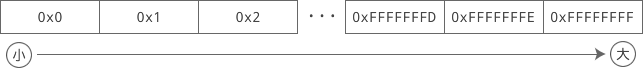

# C语言scanf：读取从键盘输入的数据（含输入格式汇总表）

程序是人机交互的媒介，有输出必然也有输入，第三章我们讲解了如何将数据输出到显示器上，本章我们开始讲解如何从键盘输入数据。在C语言中，有多个函数可以从键盘获得用户输入：

- scanf()：和 printf() 类似，scanf() 可以输入多种类型的数据。
- getchar()、getche()、getch()：这三个函数都用于输入单个字符。
- gets()：获取一行数据，并作为字符串处理。


scanf() 是最灵活、最复杂、最常用的输入函数，但它不能完全取代其他函数，大家都要有所了解。

本节我们只讲解 scanf()，其它的输入函数将在下节讲解。

## scanf()函数

scanf 是 scan format 的缩写，意思是格式化扫描，也就是从键盘获得用户输入，和 printf 的功能正好相反。

我们先来看一个例子：

```c
#include <stdio.h>
int main()
{
    int a = 0, b = 0, c = 0, d = 0;
    scanf("%d", &a);  //输入整数并赋值给变量a
    scanf("%d", &b);  //输入整数并赋值给变量b
    printf("a+b=%d\n", a+b);  //计算a+b的值并输出
    scanf("%d %d", &c, &d);  //输入两个整数并分别赋值给c、d
    printf("c*d=%d\n", c*d);  //计算c*d的值并输出
    return 0;
}
```

运行结果：
12↙
60↙
a+b=72
10 23↙
c*d=230

> `↙`表示按下回车键。

从键盘输入12，按下回车键，scanf() 就会读取输入数据并赋值给变量 a；本次输入结束，接着执行下一个 scanf() 函数，再从键盘输入 60，按下回车键，就会将 60 赋值给变量 b，都是同样的道理。

第 8 行代码中，scanf() 有两个以空格分隔的`%d`，后面还跟着两个变量，这要求我们一次性输入两个整数，并分别赋值给 c 和 d。注意`"%d %d"`之间是有空格的，所以输入数据时也要有空格。对于 scanf()，输入数据的格式要和控制字符串的格式保持一致。

其实 scanf 和 printf 非常相似，只是功能相反罢了：

```c
scanf("%d %d", &a, &b);  // 获取用户输入的两个整数，分别赋值给变量 a 和 b
printf("%d %d", a, b);  // 将变量 a 和 b 的值在显示器上输出
```

它们都有格式控制字符串，都有变量列表。不同的是，scanf 的变量前要带一个`&`符号。`&`称为取地址符，也就是获取变量在内存中的地址。

在《[数据在内存中的存储](http://c.biancheng.net/view/1726.html)》一节中讲到，数据是以二进制的形式保存在内存中的，字节（Byte）是最小的可操作单位。为了便于管理，我们给每个字节分配了一个编号，使用该字节时，只要知道编号就可以，就像每个学生都有学号，老师会随机抽取学号来让学生回答问题。字节的编号是有顺序的，从 0 开始，接下来是 1、2、3……

下图是 4G 内存中每个字节的编号（以十六进制表示）：


这个编号，就叫做地址（Address）。`int a;`会在内存中分配四个字节的空间，我们将第一个字节的地址称为变量 a 的地址，也就是`&a`的值。对于前面讲到的整数、浮点数、字符，都要使用 & 获取它们的地址，scanf 会根据地址把读取到的数据写入内存。

我们不妨将变量的地址输出看一下：

```c
#include <stdio.h>
int main()
{
    int a='F';
    int b=12;
    int c=452;
    printf("&a=%p, &b=%p, &c=%p\n", &a, &b, &c);
   
    return 0;
}
```

输出结果：
&a=0x18ff48, &b=0x18ff44, &c=0x18ff40

`%p`是一个新的格式控制符，它表示以十六进制的形式（带小写的前缀）输出数据的地址。如果写作`%P`，那么十六进制的前缀也将变成大写形式。


图：a、b、c 的内存地址

> 注意：这里看到的地址都是假的，是虚拟地址，并不等于数据在物理内存中的地址。虚拟地址是现代计算机因内存管理的需要才提出的概念，我们将在《[C语言内存精讲](http://c.biancheng.net/c/140/)》专题中详细讲解。

再来看一个 scanf 的例子：

```c
#include <stdio.h>
int main()
{
    int a, b, c;
    scanf("%d %d", &a, &b);
    printf("a+b=%d\n", a+b);
    scanf("%d   %d", &a, &b);
    printf("a+b=%d\n", a+b);
    scanf("%d, %d, %d", &a, &b, &c);
    printf("a+b+c=%d\n", a+b+c);
   
    scanf("%d is bigger than %d", &a, &b);
    printf("a-b=%d\n", a-b);
    return 0;
}
```

运行结果：

```
10    20↙
a+b=30
100 200↙
a+b=300
56,45,78↙
a+b+c=179
25 is bigger than 11↙
a-b=14
```


第一个 scanf() 的格式控制字符串为`"%d %d"`，中间有一个空格，而我们却输入了`10  20`，中间有多个空格。第二个 scanf() 的格式控制字符串为`"%d  %d"`，中间有多个空格，而我们却输入了`100 200`，中间只有一个空格。这说明 scanf() 对输入数据之间的空格的处理比较宽松，并不要求空格数严格对应，多几个少几个无所谓，只要有空格就行。

第三个 scanf() 的控制字符串为`"%d, %d, %d"`，中间以逗号分隔，所以输入的整数也要以逗号分隔。

第四个 scanf() 要求整数之间以`is bigger than`分隔。

用户每次按下回车键，程序就会认为完成了一次输入操作，scanf() 开始读取用户输入的内容，并根据格式控制字符串从中提取有效数据，只要用户输入的内容和格式控制字符串匹配，就能够正确提取。

本质上讲，用户输入的内容都是字符串，scanf() 完成的是从字符串中提取有效数据的过程。

## 连续输入

在本节第一段示例代码中，我们一个一个地输入变量 a、b、c、d 的值，每输入一个值就按一次回车键。现在我们改变输入方式，将四个变量的值一次性输入，如下所示：

12 60 10 23↙
a+b=72
c*d=230

可以发现，两个 scanf() 都能正确读取。合情合理的猜测是，第一个 scanf() 读取完毕后没有抛弃多余的值，而是将它们保存在了某个地方，下次接着使用。

如果我们多输入一个整数，会怎样呢？

12 60 10 23 99↙
a+b=72
c*d=230

这次我们多输入了一个 99，发现 scanf() 仍然能够正确读取，只是 99 没用罢了。

如果我们少输入一个整数，又会怎样呢？

12 60 10↙
a+b=72
23↙
c*d=230

输入三个整数后，前两个 scanf() 把前两个整数给读取了，剩下一个整数 10，而第三个 scanf() 要求输入两个整数，一个单独的 10 并不能满足要求，所以我们还得继续输入，凑够两个整数以后，第三个 scanf() 才能读取完毕。

从本质上讲，我们从键盘输入的数据并没有直接交给 scanf()，而是放入了缓冲区中，直到我们按下回车键，scanf() 才到缓冲区中读取数据。如果缓冲区中的数据符合 scanf() 的要求，那么就读取结束；如果不符合要求，那么就继续等待用户输入，或者干脆读取失败。我们将在本章的《[进入缓冲区（缓存）的世界，破解一切与输入输出有关的疑难杂症](http://c.biancheng.net/view/vip_1797.html)》《[结合C语言缓冲区谈scanf函数](http://c.biancheng.net/view/vip_1798.html)》两节中详细讲解缓冲区。

注意，如果缓冲区中的数据不符合 scanf() 的要求，要么继续等待用户输入，要么就干脆读取失败，上面我们演示了“继续等待用户输入”的情形，下面我们对代码稍作修改，演示“读取失败”的情形。

```c
#include <stdio.h>
int main()
{
    int a = 1, b = 2, c = 3, d = 4;  //修改处：给变量赋予不同的初始值
    scanf("%d", &a);
    scanf("%d", &b);
    printf("a=%d, b=%d\n", a, b);
    scanf("%d %d", &c, &d);
    printf("c=%d, d=%d\n", c, d);
   
    return 0;
}
```

运行结果：

12 60 a10↙
a=12, b=60
c=3, d=4

前两个整数被正确读取后，剩下了 a10，而第三个 scanf() 要求输入两个十进制的整数，a10 无论如何也不符合要求，所以只能读取失败。输出结果也证明了这一点，c 和 d 的值并没有被改变。

这说明 scanf() 不会跳过不符合要求的数据，遇到不符合要求的数据会读取失败，而不是再继续等待用户输入。

总而言之，正是由于缓冲区的存在，才使得我们能够多输入一些数据，或者一次性输入所有数据，这可以认为是缓冲区的一点优势。然而，缓冲区也带来了一定的负面影响，甚至会导致很奇怪的行为，请看下面的代码：

```c
#include <stdio.h>
int main()
{
    int a = 1, b = 2;
    scanf("a=%d", &a);
    scanf("b=%d", &b);
    printf("a=%d, b=%d\n", a, b);
    return 0;
}
```

输入示例：

a=99↙
a=99, b=2

输入`a=99`，按下回车键，程序竟然运行结束了，只有第一个 scanf() 成功读取了数据，第二个 scanf() 仿佛没有执行一样，根本没有给用户任何机会去输入数据。

如果我们换一种输入方式呢？

a=99b=200↙
a=99, b=200

这样 a 和 b 都能够正确读取了。注意，`a=99b=200`中间是没有任何空格的。

肯定有好奇的小伙伴又问了，如果`a=99b=200`两个数据之间有空格又会怎么样呢？我们不妨亲试一下：

a=99 b=200↙
a=99, b=2

你看，第二个 scanf() 又读取失败了！在前面的例子中，输入的两份数据之前都是有空格的呀，为什么这里不能带空格呢，真是匪夷所思。好吧，这个其实还是跟缓冲区有关系，我将在《[结合C语言缓冲区谈scanf()函数](http://c.biancheng.net/view/vip_1798.html)》中深入讲解。

要想破解 scanf() 输入的问题，一定要学习缓冲区，它能使你对输入输出的认识上升到一个更高的层次，以后不管遇到什么疑难杂症，都能迎刃而解。可以说，输入输出的“命门”就在于缓冲区。

## 输入其它数据

除了输入整数，scanf() 还可以输入单个字符、字符串、小数等，请看下面的演示：

```c
#include <stdio.h>
int main()
{
    char letter;
    int age;
    char url[30];
    float price;
   
    scanf("%c", &letter);
    scanf("%d", &age);
    scanf("%s", url); //可以加&也可以不加&
    scanf("%f", &price);
   
    printf("26个英文字母的最后一个是 %c。\n", letter);
    printf("C语言中文网已经成立%d年了，网址是 %s，开通VIP会员的价格是%g。\n", age, url, price);
    return 0;
}
```

运行示例：

z↙
6↙
http://c.biancheng.net↙
159.9↙
26个英文字母的最后一个是 z。
C语言中文网已经成立6年了，网址是 http://c.biancheng.net，开通VIP会员的价格是159.9。

scanf() 和 printf() 虽然功能相反，但是格式控制符是一样的，单个字符、整数、小数、字符串对应的格式控制符分别是 %c、%d、%f、%s。

#### 对读取字符串的说明

在《[在C语言中使用英文字符](http://c.biancheng.net/view/1766.html)》一节中，我们谈到了字符串的两种定义形式，它们分别是：

char str1[] = "http://c.biancheng.net";
char *str2 = "C语言中文网";

这两种形式其实是有区别的，第一种形式的字符串所在的内存既有读取权限又有写入权限，第二种形式的字符串所在的内存只有读取权限，没有写入权限。printf()、puts() 等字符串输出函数只要求字符串有读取权限，而 scanf()、gets() 等字符串输入函数要求字符串有写入权限，所以，第一种形式的字符串既可以用于输出函数又可以用于输入函数，而第二种形式的字符串只能用于输出函数。

另外，对于第一种形式的字符串，在`[ ]`里面要指明字符串的最大长度，如果不指明，也可以根据`=`后面的字符串来自动推算，此处，就是根据`"http://c.biancheng.net"`的长度来推算的。但是在前一个例子中，开始我们只是定义了一个字符串，并没有立即给它赋值，所以没法自动推算，只能手动指明最大长度，这也就是为什么一定要写作`char url[30]`，而不能写作`char url[]`的原因。

读者还要注意第 11 行代码，这行代码用来输入字符串。上面我们说过，scanf() 读取数据时需要的是数据的地址，整数、小数、单个字符都要加`&`取地址符，这很容易理解；但是对于此处的 url 字符串，我们并没有加 &，这是因为，字符串的名字会自动转换为字符串的地址，所以不用再多此一举加 & 了。当然，你也可以加上，这样虽然不会导致错误，但是编译器会产生警告，至于为什么，我们将会在《[数组和指针绝不等价，数组是另外一种类型](http://c.biancheng.net/view/vip_2018.html)》《[数组到底在什么时候会转换为指针](http://c.biancheng.net/view/vip_2019.html)》中讲解。

关于字符串，后续章节我们还会专门讲解，这里只要求大家会模仿，不要彻底理解，也没法彻底理解。

最后需要注意的一点是，scanf() 读取字符串时以空格为分隔，遇到空格就认为当前字符串结束了，所以无法读取含有空格的字符串，请看下面的例子：

```c
#include <stdio.h>
int main()
{
    char author[30], lang[30], url[30];
    scanf("%s %s", author, lang);
    printf("author:%s \nlang: %s\n", author, lang);
    scanf("%s", url);
    printf("url: %s\n", url);
    return 0;
}
```

运行示例：

YanChangSheng C-Language↙
author:YanChangSheng
lang: C-Language
http://c.biancheng.net http://biancheng.net↙
url: http://c.biancheng.net

对于第一个 scanf()，它将空格前边的字符串赋值给 author，将空格后边的字符串赋值给 lang；很显然，第一个字符串遇到空格就结束了，第二个字符串到了本行的末尾结束了。

或许第二个 scanf() 更能说明问题，我们输入了两个网址，但是 scanf() 只读取了一个，就是因为这两个网址以空格为分隔，scanf() 遇到空格就认为字符串结束了，不再继续读取了。

## scanf() 格式控制符汇总

| 格式控制符   | 说明                                                         |
| ------------ | ------------------------------------------------------------ |
| %c           | 读取一个单一的字符                                           |
| %hd、%d、%ld | 读取一个十进制整数，并分别赋值给 short、int、long 类型       |
| %ho、%o、%lo | 读取一个八进制整数（可带前缀也可不带），并分别赋值给 short、int、long 类型 |
| %hx、%x、%lx | 读取一个十六进制整数（可带前缀也可不带），并分别赋值给 short、int、long 类型 |
| %hu、%u、%lu | 读取一个无符号整数，并分别赋值给 unsigned short、unsigned int、unsigned long 类型 |
| %f、%lf      | 读取一个十进制形式的小数，并分别赋值给 float、double 类型    |
| %e、%le      | 读取一个指数形式的小数，并分别赋值给 float、double 类型      |
| %g、%lg      | 既可以读取一个十进制形式的小数，也可以读取一个指数形式的小数，并分别赋值给 float、double 类型 |
| %s           | 读取一个字符串（以空白符为结束）                             |

