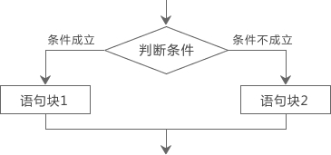

# C语言if else语句详解

前面我们看到的代码都是顺序执行的，也就是先执行第一条语句，然后是第二条、第三条……一直到最后一条语句，这称为顺序结构。

但是对于很多情况，顺序结构的代码是远远不够的，比如一个程序限制了只能成年人使用，儿童因为年龄不够，没有权限使用。这时候程序就需要做出判断，看用户是否是成年人，并给出提示。

在C语言中，使用`if`和`else`关键字对条件进行判断。请先看下面的代码：

```c
#include <stdio.h>
int main()
{
    int age;
    printf("请输入你的年龄：");
    scanf("%d", &age);
    if(age>=18){
        printf("恭喜，你已经成年，可以使用该软件！\n");
    }else{
        printf("抱歉，你还未成年，不宜使用该软件！\n");
    }
    return 0;
}
```

可能的运行结果：

请输入你的年龄：23↙
恭喜，你已经成年，可以使用该软件！

或者：

请输入你的年龄：16
抱歉，你还未成年，不宜使用该软件！

这段代码中，`age>=18`是需要判断的条件，`>=`表示“大于等于”，等价于数学中的`≥`。

如果条件成立，也即 age 大于或者等于 18，那么执行`if`后面的语句（第8行）；如果条件不成立，也即 age 小于 18，那么执行`else`后面的语句（第10行）。

if 和 else 是两个新的关键字，if 意为“如果”，else 意为“否则”，用来对条件进行判断，并根据判断结果执行不同的语句。总结起来，[if else](http://c.biancheng.net/c/if_else/) 的结构为：

if(判断条件){
  语句块1
}else{
  语句块2
}

意思是，如果判断条件成立，那么执行语句块1，否则执行语句块2 。其执行过程可表示为下图：


所谓语句块（Statement Block），就是由`{ }`包围的一个或多个语句的集合。如果语句块中只有一个语句，也可以省略`{ }`，例如：

```c
if(age>=18) printf("恭喜，你已经成年，可以使用该软件！\n");
else printf("抱歉，你还未成年，不宜使用该软件！\n");
```


由于[if else 语句](http://c.biancheng.net/c/if_else/)可以根据不同的情况执行不同的代码，所以也叫分支结构或选择结构，上面的代码中，就有两个分支。

求两个数中的较大值：

```c
#include <stdio.h>
int main()
{
    int a, b, max;
    printf("输入两个整数：");
    scanf("%d %d", &a, &b);
    if(a>b) max=a;
    else max=b;
    printf("%d和%d的较大值是：%d\n", a, b, max);
    return 0;
}
```

运行结果：
输入两个整数：34 28↙
34和28的较大值是：34

本例中借助变量max，用max来保存较大的值，最后将max输出。

## 只使用if语句

有的时候，我们需要在满足某种条件时进行一些操作，而不满足条件时就不进行任何操作，这个时候我们可以只使用 if 语句。也就是说，if else 不必同时出现。

单独使用 if 语句的形式为：

if(判断条件){
  语句块
}

意思是，如果判断条件成立就执行语句块，否则直接跳过。其执行过程可表示为下图：


只使用 if 语句来求两个数中的较大值：

```c
#include <stdio.h>
int main()
{
    int a, b, max;
    printf("输入两个整数：");
    scanf("%d %d", &a, &b);
    max=b;  // 假设b最大
    if(a>b) max=a;  // 如果a>b，那么更改max的值
    printf("%d和%d的较大值是：%d\n", a, b, max);
    return 0;
}
```

运行结果：
输入两个整数：34 28
34和28的较大值是：34

本例程序中，输入两个数a、b。把b先赋予变量max，再用 if 语句判别max和b的大小，如max小于b，则把b赋予max。因此max中总是大数，最后输出max的值。

## 多个[if else语句](http://c.biancheng.net/c/if_else/)

if else 语句也可以多个同时使用，构成多个分支，形式如下：

if(判断条件1){
  语句块1
} else if(判断条件2){
  语句块2
}else if(判断条件3){
  语句块3
}else if(判断条件m){
  语句块m
}else{
   语句块n
}

意思是，从上到下依次检测判断条件，当某个判断条件成立时，则执行其对应的语句块，然后跳到整个 if else 语句之外继续执行其他代码。如果所有判断条件都不成立，则执行语句块n，然后继续执行后续代码。

也就是说，一旦遇到能够成立的判断条件，则不再执行其他的语句块，所以最终只能有一个语句块被执行。

例如，使用多个 if else 语句判断输入的字符的类别：

```c
#include <stdio.h>
int main(){
    char c;
    printf("Input a character:");
    c=getchar();
    if(c<32)
        printf("This is a control character\n");
    else if(c>='0'&&c<='9')
        printf("This is a digit\n");
    else if(c>='A'&&c<='Z')
        printf("This is a capital letter\n");
    else if(c>='a'&&c<='z')
        printf("This is a small letter\n");
    else
        printf("This is an other character\n");
    return 0;
}
```

运行结果：
Input a character:e↙
This is a small letter

本例要求判别键盘输入字符的类别。可以根据输入字符的ASCII码来判别类型。由ASCII码表可知ASCII值小于32的为控制字符。在“0”和“9”之间的为数字，在“A”和“Z”之间为大写字母， 在“a”和“z”之间为小写字母，其余则为其它字符。这是一个多分支选择的问题，用多个 if else 语句编程，判断输入字符ASCII码所在的范围，分别给出不同的输出。例如输入为“e”，输出显示它为小写字符。

在使用 if 语句时还应注意以下两点：

- 在 if 语句中，判断条件必须用括号括起来。
- 语句块由`{ }`包围，但要注意的是在`}`之后不需要再加分号`;`（当然加上也没错）。

## if语句的嵌套

if 语句也可以嵌套使用，例如：

```c
#include <stdio.h>
int main(){
    int a,b;
    printf("Input two numbers:");
    scanf("%d %d",&a,&b);
    if(a!=b){  //!=表示不等于
        if(a>b) printf("a>b\n");
        else printf("a<b\n");
    }else{
        printf("a=b\n");
    }
    return 0;
}
```

运行结果：
Input two numbers:12 68
a<b

if 语句嵌套时，要注意 if 和 else 的配对问题。C语言规定，else 总是与它前面最近的 if 配对，例如：

```c
if(a!=b)  // ①
if(a>b) printf("a>b\n");  // ②
else printf("a<b\n");  // ③
```

③和②配对，而不是和①配对。