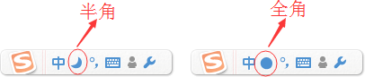

# 编程时请选择正确的输入法，严格区分中英文

计算机起源于美国，C语言、[C++](http://c.biancheng.net/cplus/)、[Java](http://c.biancheng.net/java/)、[JavaScript](http://c.biancheng.net/js/) 等很多流行的编程语言都是美国人发明的，所以在编写代码的时候必须使用**英文半角输入法**，尤其是标点符号，初学者一定要引起注意。

例如，上节我们使用 puts 语句在显示器上输出内容：

puts("C语言中文网");

这里的括号、双引号、分号都必须是英文符号，而且是半角的。下图演示了如何将搜狗输入法切换到英文半角状态：

图1：搜狗输入法

一些相似的中英文标点符号：

- 中文分号；和英文分号;；
- 中文逗号，和英文逗号,；
- 中文冒号：和英文冒号:；
- 中文括号（）和英文括号()；
- 中文问号？和英文问号?；
- 中文单引号’‘和英文单引号' '；
- 中文双引号“ ”和英文双引号" "。

初学者请务必注意标点符号的问题，它们在视觉上的差别很小，一旦将英文符号写成中文符号就会导致错误，而且往往不容易发现。我在给[VIP会员](http://vip.biancheng.net/)进行一对一答疑的过程中，经常会遇到类似的错误，有些同学甚至会在这里跌倒好几次。

## 全角和半角输入法的区别

全角和半角的区别主要在于除汉字以外的其它字符，比如标点符号、英文字母、阿拉伯数字等，全角字符和半角字符所占用的位置的大小不同。

在计算机屏幕上，一个汉字要占两个英文字符的位置，人们把一个英文字符所占的位置称为“半角”，相对地把一个汉字所占的位置称为“全角”。

标点符号、英文字母、阿拉伯数字等这些字符不同于汉字，在半角状态它们被作为英文字符处理，而在全角状态作为中文字符处理，请看下面的例子。

半角输入：

C语言中文网！Hello C,I like!

全角输入：

Ｃ语言中文网！Ｈｅｌｌｏ　Ｃ，Ｉ　ｌｉｋｅ！

另外最重要的一点是：“相同”字符在全角和半角状态下对应的编码值（例如 Unicode 编码、GBK 编码等）不一样，所以它们是不同的字符。

图：搜狗输入法半角和全角

我们知道，在编程时要使用英文半角输入法。为了加强练习，出个选择题，请大家判断下面哪一种描述是正确的：
A) 编程的时候不用在意中英文符号的区别。
B) 在源代码的任何地方都不能出现中文汉字、字符等。
C) 感叹号没有中文和英文的区别。
D) 编程时，使用的英文引号，也有左引号和右引号的区别。
E) 中文和英文模式下的制表符（键盘tab键）输入效果一致。

答案：E 选项正确。