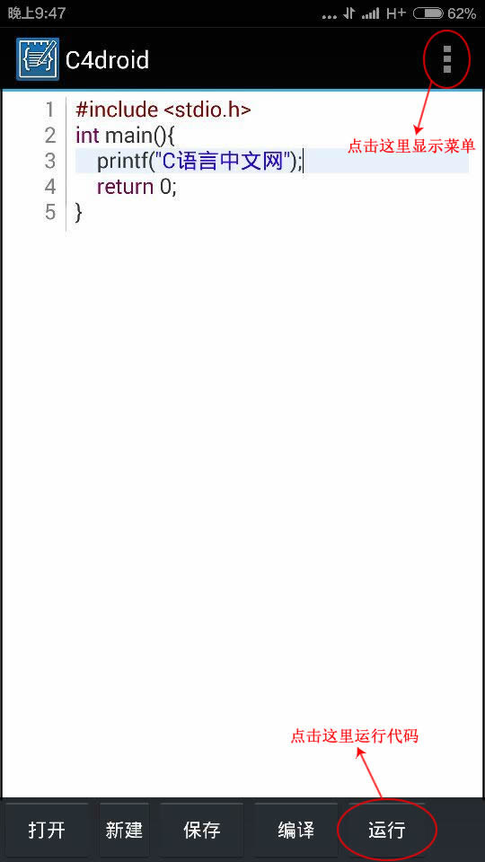
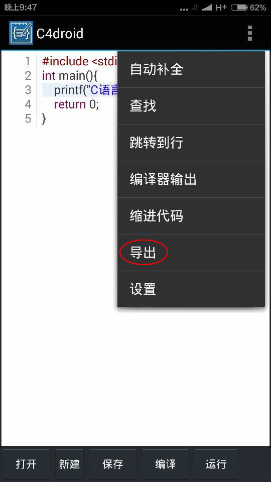
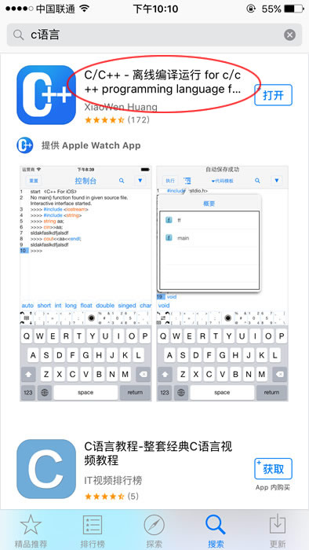
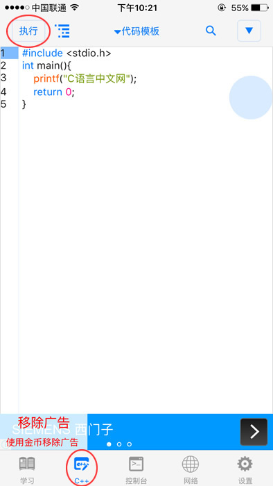

# 如何在手机上编写C语言代码

对于没有电脑，或者电脑不在身边的读者，也可以使用手机编译C语言代码。不过由于手机屏幕限制，虚拟键盘使用非常不便，要经常在英文、数字、符号之间切换，代码编写效率堪忧。

## 在Android手机上运行C语言程序

在Android手机上，可以使用C4droid来编译和运行C语言程序。

C4droid 是一款Android设备上的C/C++开发环境，默认以TCC（Tiny C Compiler）为编译器，可以选择安装GCC插件（30MB左右，无Root可正常使用）。

C4droid 支持代码高亮、自动补全、代码缩进等常用功能，支持将程序打包成`.apk`安装包。

C4droid 4.9.8 汉化版下载地址：http://pan.baidu.com/s/1skwD5KD   提取密码：wn5q

下载地址中还包含了C4droid卸载工具，如果在安装C4droid过程中出错，就可以安装卸载工具，将相关的组件先卸载干净再安装。

安装后的截图如下：

点击“运行”按钮即可运行我们编写的程序。点击右上方的按钮，会弹出一个菜单，如下图所示：

点击“导出”按钮，即可将程序导出为`.apk`格式，在Android设备上运行。

## 在iPhone上运行C语言程序

在App Store里面搜索“C语言”或者“C语言编译器”，会看到好几款C/C++开发工具，如下图所示：

这里我们不妨选择第一款，安装后的截图如下：

将选项卡切换到“C++”，输入代码，点击“执行”按钮即可看到运行结果。

这款编译器是免费下载的，但是内部带有广告，而且还有收费功能，不缺银子的读者不妨为开发者做些贡献。