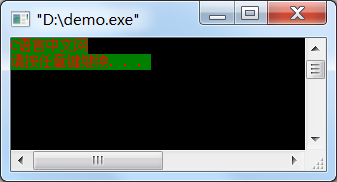
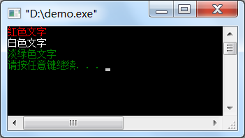

# 彩色版的C语言，让文字更漂亮

> 对于初学者来说，本节涉及到的代码比较复杂，名字也不容易记住，大家只需要把代码复制到编译器，看一下运行效果就可以。本节重在演示C语言能做什么，而不是教授大家知识点（这些知识点也不是C语言的重点），所以，不理解的就放过吧，不会影响后面的学习。

C语言不总是“黑底白字”，它也可以是彩色的，可以调用`Windows.h`头文件下的`SetConsoleTextAttribute`函数改变文字和背景颜色。

调用形式为：

```
SetConsoleTextAttribute( HANDLE hConsoleOutput, WORD wAttributes );
```

`hConsoleOutput`表示控制台缓冲区句柄，可以通过`GetStdHandle(STD_OUTPUT_HANDLE)`来获得；`wAttributes`表示文字颜色和背景颜色。

> 这里不去追究HANDLE的含义，后续在[Windows开发](http://c.biancheng.net/cpp/windows/)中会详细讲解。

`WORD`在`windows.h`中定义，等同于`unsigned short`，使用低4位表示文字（前景）颜色，高4位表示文字背景颜色，所以它的取值为`xx`。x为一位16进制数，即`0~F`都可以使用，可以随意组合。

0~F 分别代表的颜色如下：

0 = 黑色   8 = 灰色   1 = 淡蓝    9 = 蓝色
2 = 淡绿   A = 绿色   3 = 湖蓝    B = 淡浅绿  
C = 红色   4 = 淡红   5 = 紫色   D = 淡紫  
6 = 黄色   E = 淡黄   7 = 白色   F = 亮白

例如，将背景设置为淡绿色，文字设置为红色：

```
#include <stdio.h>#include <windows.h>int main(){    HANDLE hConsole = GetStdHandle(STD_OUTPUT_HANDLE);    SetConsoleTextAttribute(hConsole, 0x2C );    puts("C语言中文网");    return 0;}
```

运行结果：


如果只希望设置文字颜色，背景保持黑色，那么也可以只给出一位16进制数，例如：

```
SetConsoleTextAttribute(hConsole, 0xC );  //将文字颜色设置为红色
SetConsoleTextAttribute(hConsole, 0xF );  //将文字颜色设置为白色
```

再来看一个例子：

```
#include <stdio.h>#include <windows.h>int main(){    HANDLE hConsole = GetStdHandle(STD_OUTPUT_HANDLE);    SetConsoleTextAttribute(hConsole, 0xC );    puts("红色文字");    SetConsoleTextAttribute(hConsole, 0xF );    puts("白色文字");    SetConsoleTextAttribute(hConsole, 2 );    puts("淡绿色文字");    return 0;}
```

运行结果：
