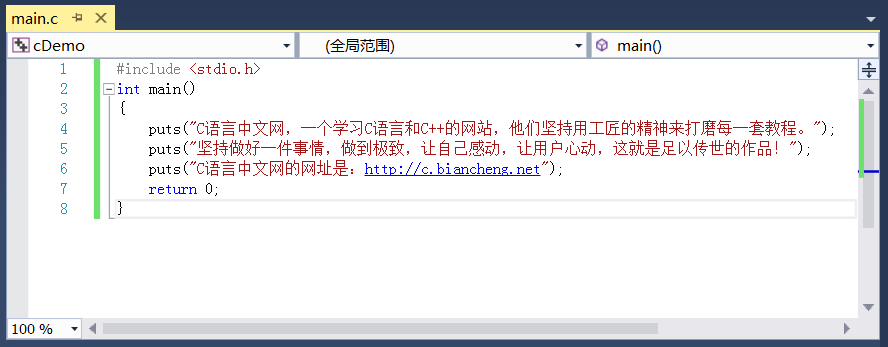

# 在屏幕上输出各种类型的数据

在《[第一个C语言程序](http://c.biancheng.net/view/1734.html)》一节中，我们使用 puts 来输出字符串。puts 是 output string 的缩写，只能用来输出字符串，不能输出整数、小数、字符等，我们需要用另外一个函数，那就是 printf。

printf 比 puts 更加强大，不仅可以输出字符串，还可以输出整数、小数、单个字符等，并且输出格式也可以自己定义，例如：

- 以十进制、八进制、十六进制形式输出；
- 要求输出的数字占 n 个字符的位置；
- 控制小数的位数。


printf 是 print format 的缩写，意思是“格式化打印”。这里所谓的“打印”就是在屏幕上显示内容，与“输出”的含义相同，所以我们一般称 printf 是用来格式化输出的。

先来看一个简单的例子：

```c
printf("C语言中文网");
```

这个语句可以在屏幕上显示“C语言中文网”，与`puts("C语言中文网");`的效果类似。

输出变量 abc 的值：

```c
int abc=999;
printf("%d", abc);
```

这里就比较有趣了。先来看`%d`，d 是 decimal 的缩写，意思是十进制数，%d 表示以十进制整数的形式输出。输出什么呢？输出变量 abc 的值。%d 与 abc 是对应的，也就是说，会用 abc 的值来替换 %d。

再来看个复杂点的：

```c
int abc=999;
printf("The value of abc is %d !", abc);
```

会在屏幕上显示：
The value of abc is 999 !

你看，字符串 "The value of abc is %d !" 中的 %d 被替换成了 abc 的值，其他字符没有改变。这说明 %d 比较特殊，不会原样输出，会被替换成对应的变量的值。

再来看：

```c
int a=100;
int b=200;
int c=300;
printf("a=%d, b=%d, c=%d", a, b, c);
```

会在屏幕上显示：
a=100, b=200, c=300

再次证明了 %d 与后面的变量是一一对应的，第一个 %d 对应第一个变量，第二个 %d 对应第二个变量……

`%d`称为格式控制符，它指明了以何种形式输出数据。格式控制符均以`%`开头，后跟其他字符。%d 表示以十进制形式输出一个整数。除了 %d，printf 支持更多的格式控制，例如：

- %c：输出一个字符。c 是 character 的简写。
- %s：输出一个字符串。s 是 string 的简写。
- %f：输出一个小数。f 是 float 的简写。


除了这些，printf 支持更加复杂和优美的输出格式，考虑到读者的基础暂时不够，我们将在《[C语言数据输出大汇总以及轻量进阶](http://c.biancheng.net/view/1793.html)》一节中展开讲解。

我们把代码补充完整，体验一下：

```c
#include <stdio.h>
int main()
{
    int n = 100;
    char c = '@';  //字符用单引号包围，字符串用双引号包围
    float money = 93.96;
    printf("n=%d, c=%c, money=%f\n", n, c, money);
    return 0;
}
```

输出结果：
n=100, c=@, money=93.959999

要点提示：
\1) `\n`是一个整体，组合在一起表示一个换行字符。换行符是 ASCII 编码中的一个控制字符，无法在键盘上直接输入，只能用这种特殊的方法表示，被称为转义字符，我们将在《[C语言转义字符](http://c.biancheng.net/view/1769.html)》一节中有具体讲解，请大家暂时先记住`\n`的含义。

> 所谓换行，就是让文本从下一行的开头输出，相当于在编辑 Word 或者 TXT 文档时按下回车键。

puts 输出完成后会自动换行，而 printf 不会，要自己添加换行符，这是 puts 和 printf 在输出字符串时的一个区别。

\2) `//`后面的为注释。注释用来说明代码是什么意思，起到提示的作用，可以帮助我们理解代码。注释虽然也是代码的一部分，但是它并不会给程序带来任何影响，编译器在编译阶段会忽略注释的内容，或者说删除注释的内容。我们将在《[C语言标识符、关键字和注释](http://c.biancheng.net/view/1770.html)》一节中详细讲解。

\3) money 的输出值并不是 93.96，而是一个非常接近的值，这与小数本身的存储机制有关，这种机制导致很多小数不能被精确地表示，即使像 93.96 这种简单的小数也不行。我们将在《[小数在内存中是如何存储的，揭秘诺贝尔奖级别的设计（长篇神文）](http://c.biancheng.net/view/vip_1764.html)》一节详细介绍。

我们也可以不用变量，将数据直接输出：

```c
#include <stdio.h>
int main()
{
    float money = 93.96;
    printf("n=%d, c=%c, money=%f\n", 100, '@', money);
    return 0;
}
```

输出结果与上面相同。

在以后的编程中，我们会经常使用 printf，说它是C语言中使用频率最高的一个函数一点也不为过，每个C语言程序员都应该掌握 printf 的用法，这是最基本的技能。

不过 printf 的用法比较灵活，也比较复杂，初学者知识储备不足，不能一下子掌握，目前大家只需要掌握最基本的用法，以后随着编程知识的学习，我们会逐步介绍更加高级的用法，最终让大家完全掌握 printf。

## 【脑筋急转弯】%ds输出什么

%d 输出整数，%s 输出字符串，那么 %ds 输出什么呢？

我们不妨先来看一个例子：

```c
#include <stdio.h>
int main()
{
    int a=1234;
    printf("a=%ds\n", a);
    return 0;
}
```

运行结果：
a=1234s

从输出结果可以发现，`%d`被替换成了变量 a 的值，而`s`没有变，原样输出了。这是因为， `%d`才是格式控制符，`%ds`在一起没有意义，`s`仅仅是跟在`%d`后面的一个普通字符，所以会原样输出。

## 【拓展】如何在字符串中书写长文本

假设现在我们要输出一段比较长的文本，它的内容为：

C语言中文网，一个学习C语言和[C++](http://c.biancheng.net/cplus/)的网站，他们坚持用工匠的精神来打磨每一套教程。坚持做好一件事情，做到极致，让自己感动，让用户心动，这就是足以传世的作品！C语言中文网的网址是：http://c.biancheng.net

如果将这段文本放在一个字符串中，会显得比较臃肿，格式也不好看，就像下面这样：


超出编辑窗口宽度的文本换行


超出编辑窗口宽度的文本隐藏


当文本超出编辑窗口的宽度时，可以选择将文本换行，也可以选择将文本隐藏（可以在编辑器里面自行设置），但是不管哪种形式，在一个字符串里书写长文本总是不太美观。

当然，你可以多写几个 puts 函数，就像下面这样：




我不否认这种写法也比较美观，但是这里我要讲的是另外一种写法：

```C
#include <stdio.h>
int main()
{
    puts(
        "C语言中文网，一个学习C语言和C++的网站，他们坚持用工匠的精神来打磨每一套教程。"
        "坚持做好一件事情，做到极致，让自己感动，让用户心动，这就是足以传世的作品！"
        "C语言中文网的网址是：http://c.biancheng.net"
    );
    return 0;
}
```

在 puts 函数中，可以将一个较长的字符串分割成几个较短的字符串，这样会使得长文本的格式更加整齐。

注意，这只是形式上的分割，编译器在编译阶段会将它们合并为一个字符串，它们放在一块连续的内存中。

多个字符串并不一定非得换行，也可以将它们写在一行中，例如：

```c
#include <stdio.h>
int main()
{
    puts("C语言中文网！"  "C语言和C++！"  "http://c.biancheng.net");
    return 0;
}
```

本节讲到的 puts、printf，以及后面要讲到的 fprintf、fputs 等与字符串输出有关的函数，都支持这种写法。

