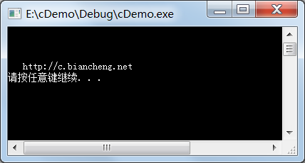
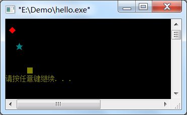

# C语言在屏幕的任意位置输出字符，开发小游戏的第一步

初学编程的读者，肯定很想编写出一个游戏来秀一下，贪吃蛇就是C语言小游戏中经典的一个，本教程的目标也是带着大家做出这款游戏，你可以猛击《[C语言贪吃蛇游戏演示和说明](http://c.biancheng.net/cpp/html/2956.html)》了解更多。

编写游戏的第一步就是搞定光标定位问题，这样你的程序就可以随心所欲、按任意顺序、在任意位置输出了。但是，C语言本身并不支持该功能，我们必须使用 Windows 提供的接口，所以要引入 windows.h 头文件。

> 因为用到了 Windows 操作系统的功能，所以本节的代码不能在 Linux 和 Mac OS 下运行。

所谓 Windows 接口，就是 Windows 这个操作系统本身提供的函数，它们都是以C语言的形式呈现的，只要我们引入了 windows.h 头文件，就可以调用这些函数，使用 Windows 提供的强大功能了。

> 因为涉及到了 Windows 编程，所以本节的内容不要求大家深入理解，能按照葫芦画瓢就可以，以后如果决定专攻 Windows 编程了，再来深入研究也不迟。

光标定位需要使用 windows.h 头文件中的`SetConsoleCursorPosition`函数，它的使用方式为：

```c
SetConsoleCursorPosition(HANDLE hConsoleOutput, COORD  dwCursorPosition);
```

`hConsoleOutput`表示控制台缓冲区句柄，可通过`GetStdHandle(STD_OUTPUT_HANDLE)`来获得；`dwCursorPosition`是光标位置，也就是第几行第几列，它是 COORD 类型的结构体。

看不懂是吧？嗯，没关系，我知道大部分读者都看不懂，所以，照着葫芦画瓢吧。

例如，将光标定位到控制台的第3行第3列：

```c
//定义光标位置
COORD coord;
coord.X = 3;  //第3行
coord.Y = 3;  //第3列
//获取控制台缓冲区句柄，固定写法
HANDLE ConsoleHandle = GetStdHandle(STD_OUTPUT_HANDLE);
//设置光标位置，固定写法
SetConsoleCursorPosition(ConsoleHandle, coord);
```

这样，程序就可以从第3行第3列开始输出了。

将代码补充完整：

```c
#include <stdio.h>
#include <windows.h>
int main(){
    //定义光标位置
    COORD coord;
    coord.X = 3;  //第3行
    coord.Y = 3;  //第3列
    //获取控制台缓冲区句柄
    HANDLE ConsoleHandle = GetStdHandle(STD_OUTPUT_HANDLE);
    //设置光标位置
    SetConsoleCursorPosition(ConsoleHandle, coord);
   
    printf("http://c.biancheng.net\n");
    return 0;
}
```

运行结果：


> 注意：窗口的左上角是第 0 行第 0 列，而不是我们通常所认为的第 1 行第 1 列。编程语言中的很多计数都是从 0 开始的，而不是从 1 开始。

搞定了光标重定位，你就可以将输出顺序打乱了，想在哪里输出就在哪里输出。例如：

```c
#include <stdio.h>
#include <windows.h>
//设置光标位置
void setCursorPosition(int x, int y);
//设置文字颜色
void setColor(int color);
int main(){
    setColor(3);
    setCursorPosition(3, 3);
    puts("★");
    setColor(0XC);
    setCursorPosition(1, 1);
    puts("◆");
    setColor(6);
    setCursorPosition(6, 6);
    puts("■");
    return 0;
}
//自定义的光标定位函数
void setCursorPosition(int x, int y){
    COORD coord;
    coord.X = x;
    coord.Y = y;
    SetConsoleCursorPosition(GetStdHandle(STD_OUTPUT_HANDLE), coord);
}
//自定义的文字颜色函数
void setColor(int color){
    SetConsoleTextAttribute(GetStdHandle(STD_OUTPUT_HANDLE), color) ;
}
```

运行结果：


可以发现，先输出的字符位置不一定靠前，后输出的字符位置不一定靠后，它们都可以在任意位置。

> 看到这里，很多初学者会不懂，甚至一头雾水，不过没关系，这里仅仅是演示，引起你对C语言的兴趣，待学完C语言的基本语法后会恍然大悟。