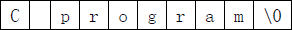

# C语言字符数组和字符串详解

用来存放字符的数组称为**字符数组**，例如：

```c
char a[10];  //一维字符数组
char b[5][10];  //二维字符数组
char c[20]={'c', '  ', 'p', 'r', 'o', 'g', 'r', 'a','m'};  // 给部分数组元素赋值
char d[]={'c', ' ', 'p', 'r', 'o', 'g', 'r', 'a', 'm' };  //对全体元素赋值时可以省去长度
```

字符数组实际上是一系列字符的集合，也就是**字符串（String）**。在C语言中，没有专门的字符串变量，没有string类型，通常就用一个字符数组来存放一个字符串。

C语言规定，可以将字符串直接赋值给字符数组，例如：

```c
char str[30] = {"c.biancheng.net"};
char str[30] = "c.biancheng.net";  //这种形式更加简洁，实际开发中常用
```

数组第 0 个元素为`'c'`，第 1 个元素为`'.'`，第 2 个元素为`'b'`，后面的元素以此类推。

为了方便，你也可以不指定数组长度，从而写作：

```c
char str[] = {"c.biancheng.net"};
char str[] = "c.biancheng.net";  //这种形式更加简洁，实际开发中常用
```

给字符数组赋值时，我们通常使用这种写法，将字符串一次性地赋值（可以指明数组长度，也可以不指明），而不是一个字符一个字符地赋值，那样做太麻烦了。

这里需要留意一个坑，字符数组只有在定义时才能将整个字符串一次性地赋值给它，一旦定义完了，就只能一个字符一个字符地赋值了。请看下面的例子：

```c
char str[7];
str = "abc123";  //错误
//正确
str[0] = 'a'; str[1] = 'b'; str[2] = 'c';
str[3] = '1'; str[4] = '2'; str[5] = '3';
```

## 字符串结束标志（划重点）

字符串是一系列连续的字符的组合，要想在内存中定位一个字符串，除了要知道它的开头，还要知道它的结尾。找到字符串的开头很容易，知道它的名字（字符数组名或者字符串名）就可以；然而，如何找到字符串的结尾呢？C语言的解决方案有点奇妙，或者说有点奇葩。

在C语言中，字符串总是以`'\0'`作为结尾，所以`'\0'`也被称为字符串结束标志，或者字符串结束符。

> `'\0'`是 ASCII 码表中的第 0 个字符，英文称为 NUL，中文称为“空字符”。该字符既不能显示，也没有控制功能，输出该字符不会有任何效果，它在C语言中唯一的作用就是作为字符串结束标志。

C语言在处理字符串时，会从前往后逐个扫描字符，一旦遇到`'\0'`就认为到达了字符串的末尾，就结束处理。`'\0'`至关重要，没有`'\0'`就意味着永远也到达不了字符串的结尾。

由`" "`包围的字符串会自动在末尾添加`'\0'`。例如，`"abc123"`从表面看起来只包含了 6 个字符，其实不然，C语言会在最后隐式地添加一个`'\0'`，这个过程是在后台默默地进行的，所以我们感受不到。

下图演示了`"C program"`在内存中的存储情形：


需要注意的是，逐个字符地给数组赋值并不会自动添加`'\0'`，例如：

```c
char str[] = {'a', 'b', 'c'};
```

数组 str 的长度为 3，而不是 4，因为最后没有`'\0'`。

当用字符数组存储字符串时，要特别注意`'\0'`，要为`'\0'`留个位置；这意味着，字符数组的长度至少要比字符串的长度大 1。请看下面的例子：

```c
char str[7] = "abc123";
```

`"abc123"`看起来只包含了 6 个字符，我们却将 str 的长度定义为 7，就是为了能够容纳最后的`'\0'`。如果将 str 的长度定义为 6，它就无法容纳`'\0'`了。

> 当字符串长度大于数组长度时，有些较老或者不严格的编译器并不会报错，甚至连警告都没有，这就为以后的错误埋下了伏笔，读者自己要多多注意。

有些时候，程序的逻辑要求我们必须逐个字符地为数组赋值，这个时候就很容易遗忘字符串结束标志`'\0'`。下面的代码中，我们将 26 个大写英文字符存入字符数组，并以字符串的形式输出：

```c
#include <stdio.h>
int main(){
    char str[30];
    char c;
    int i;
    for(c=65,i=0; c<=90; c++,i++){
        str[i] = c;
    }
    printf("%s\n", str);
    return 0;
}
```

在 VS2015 下的运行结果：

ABCDEFGHIJKLMNOPQRSTUVWXYZ口口口口i口口0 ?

`口`表示无法显示的特殊字符。

大写字母在 ASCII 码表中是连续排布的，编码值从 65 开始，到 90 结束，使用循环非常方便。

在《[C语言变量的定义位置以及初始值](http://c.biancheng.net/view/vip_1773.html)》一节中我们讲到，在很多编译器下，局部变量的初始值是随机的，是垃圾值，而不是我们通常认为的“零”值。局部数组（在函数内部定义的数组，本例中的 str 数组就是在 main() 函数内部定义的）也有这个问题，很多编译器并不会把局部数组的内存都初始化为“零”值，而是放任不管，爱是什么就是什么，所以它们的值也是没有意义的，也是垃圾值。

在函数内部定义的变量、数组、结构体、共用体等都称为局部数据。在很多编译器下，局部数据的初始值都是随机的、无意义的，而不是我们通常认为的“零”值。这一点非常重要，大家一定要谨记，否则后面会遇到很多奇葩的错误。

本例中的 str 数组在定义完成以后并没有立即初始化，所以它所包含的元素的值都是随机的，只有很小的概率会是“零”值。循环结束以后，str 的前 26 个元素被赋值了，剩下的 4 个元素的值依然是随机的，不知道是什么。

printf() 输出字符串时，会从第 0 个元素开始往后检索，直到遇见`'\0'`才停止，然后把`'\0'`前面的字符全部输出，这就是 printf() 输出字符串的原理。本例中我们使用 printf() 输出 str，按理说到了第 26 个元素就能检索到`'\0'`，就到达了字符串的末尾，然而事实却不是这样，由于我们并未对最后 4 个元素赋值，所以第 26 个元素不是`'\0'`，第 27 个也不是，第 28 个也不是……可能到了第 50 个元素才遇到`'\0'`，printf() 把这 50 个字符全部输出出来，就是上面的样子，多出来的字符毫无意义，甚至不能显示。

数组总共才 30 个元素，到了第 50 个元素不早就超出数组范围了吗？是的，的确超出范围了！然而，数组后面依然有其它的数据，printf() 也会将这些数据作为字符串输出。

你看，不注意`'\0'`的后果有多严重，不但不能正确处理字符串，甚至还会毁坏其它数据。

要想避免这些问题也很容易，在字符串的最后手动添加`'\0'`即可。修改上面的代码，在循环结束后添加`'\0'`：

```c
#include <stdio.h>
int main(){
    char str[30];
    char c;
    int i;
    for(c=65,i=0; c<=90; c++,i++){
        str[i] = c;
    }
    str[i] = 0;  //此处为添加的代码，也可以写作 str[i] = '\0';
    printf("%s\n", str);
   
    return 0;
}
```

第 9 行为新添加的代码，它让字符串能够正常结束。根据 ASCII 码表，字符`'\0'`的编码值就是 0。

但是，这样的写法貌似有点业余，或者说不够简洁，更加专业的做法是将数组的所有元素都初始化为“零”值，这样才能够从根本上避免问题。再次修改上面的代码：

```c
#include <stdio.h>
int main(){
    char str[30] = {0};  //将所有元素都初始化为 0，或者说 '\0'
    char c;
    int i;
    for(c=65,i=0; c<=90; c++,i++){
        str[i] = c;
    }
    printf("%s\n", str);
   
    return 0;
}
```

还记得《[什么是数组](http://c.biancheng.net/view/1828.html)》一节中强调过的吗？如果只初始化部分数组元素，那么剩余的数组元素也会自动初始化为“零”值，所以我们只需要将 str 的第 0 个元素赋值为 0，剩下的元素就都是 0 了。

## 字符串长度

所谓字符串长度，就是字符串包含了多少个字符（不包括最后的结束符`'\0'`）。例如`"abc"`的长度是 3，而不是 4。

在C语言中，我们使用`string.h`头文件中的 strlen() 函数来求字符串的长度，它的用法为：

length strlen(strname);

strname 是字符串的名字，或者字符数组的名字；length 是使用 strlen() 后得到的字符串长度，是一个整数。

下面是一个完整的例子，它输出《[C语言入门教程](http://c.biancheng.net/c/)》网址的长度：

```c
#include <stdio.h>
#include <string.h>  //记得引入该头文件
int main(){
    char str[] = "http://c.biancheng.net/c/";
    long len = strlen(str);
    printf("The lenth of the string is %ld.\n", len);
   
    return 0;
}
```

运行结果：
The lenth of the string is 25.