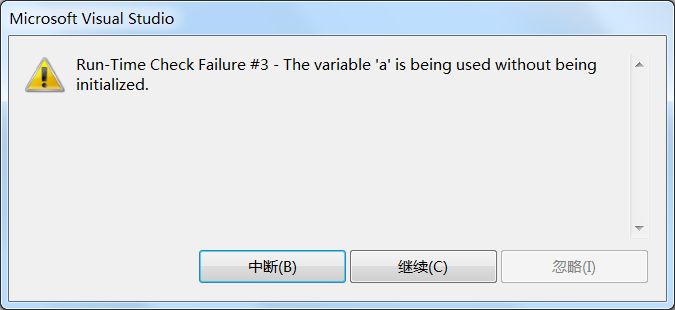
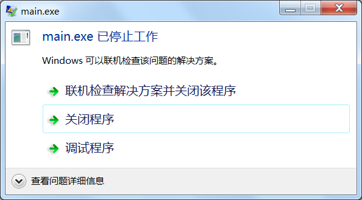
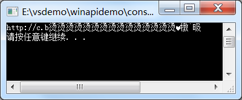

# C语言数组的越界和溢出

## 数组越界

C语言数组是静态的，不能自动扩容，当下标小于零或大于等于数组长度时，就发生了越界（Out Of Bounds），访问到数组以外的内存。如果下标小于零，就会发生下限越界（Off Normal Lower）；如果下标大于等于数组长度，就会发生上限越界（Off Normal Upper）。

C语言为了提高效率，保证操作的灵活性，并不会对越界行为进行检查，即使越界了，也能够正常编译，只有在运行期间才可能会发生问题。请看下面的代码：

```c
#include <stdio.h>
int main()
{
    int a[3] = {10, 20, 30}, i;
    for(i=-2; i<=4; i++){
        printf("a[%d]=%d\n", i, a[i]);
    }
    return 0;
}
```

运行结果：
a[-2]=-858993460
a[-1]=-858993460
a[0]=10
a[1]=20
a[2]=30
a[3]=-858993460
a[4]=-858993460

越界访问的数组元素的值都是不确定的，没有实际的含义，因为数组之外的内存我们并不知道是什么，可能是其它变量的值，可能是函数参数，可能是一个地址，这些都是不可控的。

由于C语言的”放任“，我们访问数组时必须非常小心，要确保不会发生越界。每个C语言程序员的生涯中都遇到过越界错误，我拿项上人头作保证，所以千万不要大意，因为越界错误有时候不容易发现，也不容易复现。

当发生数组越界时，如果我们对该内存有使用权限，那么程序将正常运行，但会出现不可控的结果（如上例所示）；如果我们对该内存没有使用权限，或者该内存压根就没有被分配，那么程序将会崩溃。请看下面的例子：

```c
#include <stdio.h>
int main()
{
    int a[3];
    printf("%d", a[10000]);
    return 0;
}
```

在 VS2010 下运行，会出现运行时错误：


在 C-Free 5.0 下运行，会弹出程序停止工作的对话框：


每个程序能使用的内存都是有限的，该程序要访问 4*10000 字节处的内存，显然太远了，超出了程序的访问范围。这个地方的内存可能没有被分配，可能是系统本身占用的内存，可能是其它数据的内存，如果放任这种行为，将带来非常危险的后果，操作系统只能让程序停止运行。

## 数组溢出

当赋予数组的元素个数超过数组长度时，就会发生溢出（Overflow）。如下所示：

```
int a[3] = {1, 2, 3, 4, 5};
```

数组长度为3，初始化时却赋予5个元素，超出了数组容量，所以只能保存前3个元素，后面的元素被丢弃。

GCC、LLVM/Clang、低版本的 VS（例如 VS2010）发现数组溢出只会给出警告，并不会报错。但是高版本的 VS（例如 VS2015、VS2017）发现数组溢出时会报错，禁止编译通过，微软终于聪明了一次。

一般情况下数组溢出不会有什么问题，顶多是丢失多余的元素。但是当以字符串的形式输出字符数组时，就会产生不可控的情况，请看下面的代码：

```c
#include <stdio.h>
int main()
{
    char str[10] = "http://c.biancheng.net";
    puts(str);
    return 0;
}
```

在 VS2010 下的运行结果：


字符串的长度大于数组长度，数组只能容纳字符串的前面一部分，也就是`"http://c.b"`，即使编译器在最后添加了`'\0'`，它也保存不到数组里面，所以 printf() 扫描数组时不会遇到结束符`'\0'`，只能继续向后扫描。而后面内存中的数据我们不知道是什么，字符能否识别，何时遇到`'\0'`，这些都是不确定的。当字符无法识别时，就会出现乱码，显示奇怪的字符。

由此可见，在用字符串给字符数组赋值时，要保证数组长度大于字符串长度，以容纳结束符`'\0'`。