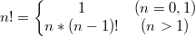

# C语言递归函数（递归调用）详解[带实例演示]

一个函数在它的函数体内调用它自身称为**递归调用**，这种函数称为**递归函数**。执行递归函数将反复调用其自身，每调用一次就进入新的一层，当最内层的函数执行完毕后，再一层一层地由里到外退出。

> 递归函数不是C语言的专利，[Java](http://c.biancheng.net/java/)、[C#](http://c.biancheng.net/csharp/)、[JavaScript](http://c.biancheng.net/js/)、[PHP](http://c.biancheng.net/php/) 等其他编程语言也都支持递归函数。

下面我们通过一个求阶乘的例子，看看递归函数到底是如何运作的。阶乘 n! 的计算公式如下：


根据公式编写如下的代码：

```c
#include <stdio.h>
//求n的阶乘
long factorial(int n) {
    if (n == 0 || n == 1) {
        return 1;
    }
    else {
        return factorial(n - 1) * n;  // 递归调用
    }
}
int main() {
    int a;
    printf("Input a number: ");
    scanf("%d", &a);
    printf("Factorial(%d) = %ld\n", a, factorial(a));
    return 0;
}
```

运行结果：
Input a number: 5↙
Factorial(5) = 120

factorial() 就是一个典型的递归函数。调用 factorial() 后即进入函数体，只有当 n==0 或 n==1 时函数才会执行结束，否则就一直调用它自身。

由于每次调用的实参为 n-1，即把 n-1 的值赋给形参 n，所以每次递归实参的值都减 1，直到最后 n-1 的值为 1 时再作递归调用，形参 n 的值也为1，递归就终止了，会逐层退出。

要想理解递归函数，重点是理解它是如何逐层进入，又是如何逐层退出的，下面我们以 5! 为例进行讲解。

## 递归的进入

\1) 求 5!，即调用 factorial(5)。当进入 factorial() 函数体后，由于形参 n 的值为 5，不等于 0 或 1，所以执行`factorial(n-1) * n`，也即执行`factorial(4) * 5`。为了求得这个表达式的结果，必须先调用 factorial(4)，并暂停其他操作。换句话说，在得到 factorial(4) 的结果之前，不能进行其他操作。这就是第一次递归。

\2) 调用 factorial(4) 时，实参为 4，形参 n 也为 4，不等于 0 或 1，会继续执行`factorial(n-1) * n`，也即执行`factorial(3) * 4`。为了求得这个表达式的结果，又必须先调用 factorial(3)。这就是第二次递归。

\3) 以此类推，进行四次递归调用后，实参的值为 1，会调用 factorial(1)。此时能够直接得到常量 1 的值，并把结果 return，就不需要再次调用 factorial() 函数了，递归就结束了。


| 层次/层数 | 实参/形参 | 调用形式     | 需要计算的表达式 | 需要等待的结果      |
| --------- | --------- | ------------ | ---------------- | ------------------- |
| 1         | n=5       | factorial(5) | factorial(4) * 5 | factorial(4) 的结果 |
| 2         | n=4       | factorial(4) | factorial(3) * 4 | factorial(3) 的结果 |
| 3         | n=3       | factorial(3) | factorial(2) * 3 | factorial(2) 的结果 |
| 4         | n=2       | factorial(2) | factorial(1) * 2 | factorial(1) 的结果 |
| 5         | n=1       | factorial(1) | 1                | 无                  |

## 递归的退出

当递归进入到最内层的时候，递归就结束了，就开始逐层退出了，也就是逐层执行 return 语句。

\1) n 的值为 1 时达到最内层，此时 return 出去的结果为 1，也即 factorial(1) 的调用结果为 1。

\2) 有了 factorial(1) 的结果，就可以返回上一层计算`factorial(1) * 2`的值了。此时得到的值为 2，return 出去的结果也为 2，也即 factorial(2) 的调用结果为 2。

\3) 以此类推，当得到 factorial(4) 的调用结果后，就可以返回最顶层。经计算，factorial(4) 的结果为 24，那么表达式`factorial(4) * 5`的结果为 120，此时 return 得到的结果也为 120，也即 factorial(5) 的调用结果为 120，这样就得到了 5! 的值。


| 层次/层数 | 调用形式     | 需要计算的表达式 | 从内层递归得到的结果 （内层函数的返回值） | 表达式的值 （当次调用的结果） |
| --------- | ------------ | ---------------- | ----------------------------------------- | ----------------------------- |
| 5         | factorial(1) | 1                | 无                                        | 1                             |
| 4         | factorial(2) | factorial(1) * 2 | factorial(1) 的返回值，也就是 1           | 2                             |
| 3         | factorial(3) | factorial(2) * 3 | factorial(2) 的返回值，也就是 2           | 6                             |
| 2         | factorial(4) | factorial(3) * 4 | factorial(3) 的返回值，也就是 6           | 24                            |
| 1         | factorial(5) | factorial(4) * 5 | factorial(4) 的返回值，也就是 24          | 120                           |


至此，我们已经对递归函数 factorial() 的进入和退出流程做了深入的讲解，把看似复杂的调用细节逐一呈献给大家，即使你是初学者，相信你也能解开谜团。

## 递归的条件

每一个递归函数都应该只进行有限次的递归调用，否则它就会进入死胡同，永远也不能退出了，这样的程序是没有意义的。

要想让递归函数逐层进入再逐层退出，需要解决两个方面的问题：

- 存在限制条件，当符合这个条件时递归便不再继续。对于 factorial()，当形参 n 等于 0 或 1 时，递归就结束了。
- 每次递归调用之后越来越接近这个限制条件。对于 factorial()，每次递归调用的实参为 n - 1，这会使得形参 n 的值逐渐减小，越来越趋近于 1 或 0。

## 更多关于递归函数的内容

factorial() 是最简单的一种递归形式——尾递归，也就是递归调用位于函数体的结尾处。除了尾递归，还有更加烧脑的两种递归形式，分别是中间递归和多层递归：

- 中间递归：发生递归调用的位置在函数体的中间；
- 多层递归：在一个函数里面多次调用自己。


递归函数也只是一种解决问题的技巧，它和其它技巧一样，也存在某些缺陷，具体来说就是：递归函数的时间开销和内存开销都非常大，极端情况下会导致程序崩溃。

我们将在接下来的三节课程里面讲解这些进阶内容：

- [C语言中间递归函数（比较复杂的一种递归）](http://c.biancheng.net/view/vip_1867.html)
- [C语言多层递归函数（最烧脑的一种递归）](http://c.biancheng.net/view/vip_1872.html)
- [递归函数的致命缺陷：巨大的时间开销和内存开销（附带优化方案）](http://c.biancheng.net/view/vip_1873.html)