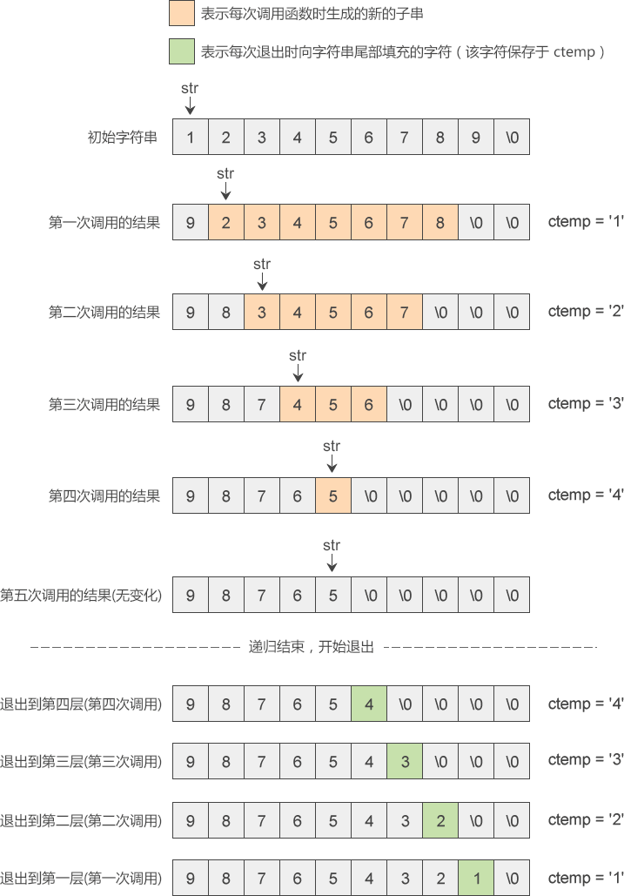

# C语言中间递归函数（比较复杂的一种递归）

所谓中间递归，就是发生递归的位置在函数体的中间，而不是末尾。

尾递归在逐层退出时除了 return 语句，一般不再执行其他操作；而中间递归在逐层退出时还要执行一些其他的操作，所以比较复杂。

下面我们以字符串反转（逆置）函数为例来讲解中间递归：

```c
#include <stdio.h>
#include <string.h>
//反转（逆置）字符串
char *reverse(char *str) {
    int len = strlen(str);
    if (len > 1) {
        char ctemp = str[0];
        str[0] = str[len - 1];
        str[len - 1] = '\0';  //最后一个字符在下次递归时不再处理
        reverse(str + 1);  //递归调用
        str[len - 1] = ctemp;
    }
    return str;
}
int main() {
    char str[20] = "123456789";
    printf("%s\n", reverse(str));
    return 0;
}
```

运行结果：
987654321

每次调用函数，都会把字符串的第 0 个字符保存到 ctemp 变量，并把最后一个字符填充到第 0 个字符的位置，

同时用`'\0'`来填充最后一个字符的位置

。

读者要注意第 11 行代码，调用 reverse() 的实参为`str+1`，这会导致形参 str 的指向发生改变，

每次递归调用时 str 都会向后移动一个字符的位置

。

通过以上**带有下划线的两点**可以得出一个结论：每次递归调用都会处理一个新的子串，这个新的子串是在原来字符串的基础上“掐头去尾”形成的。

下图演示了递归函数的整个流程：





reverse() 的整体思路是，每次调用函数只交换字符串开头和末尾的两个字符，其它字符一律不管，并且这个交换过程也是分两个阶段完成的：

- 在逐层进入递归的阶段，reverse() 只是把字符串的最后一个字符移动到最前边，但是并没有把最前边一个字符移动到最后边，而是把最前边的字符保存到 ctemp 变量。
- 在逐层退出递归的阶段，reverse() 才把 ctemp 变量中保存的字符放到字符串的最前边。


两个阶段相互合作，才能最终完成两个字符的交换。

你看，对于中间递归来说，它在进入和退出递归的两个阶段都会进行一些操作，而对于尾递归，它只会在进入递归的阶段进行一些操作，退出递归的阶段不进行任何操作，这就是中间递归和尾递归的不同。