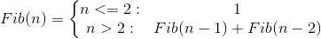
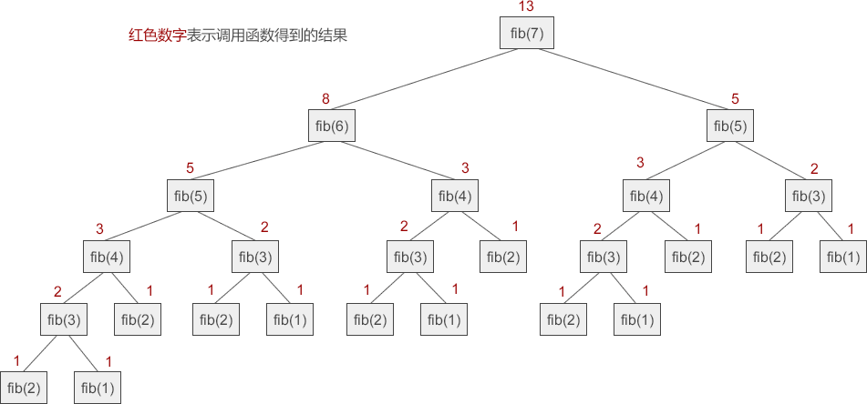

# C语言多层递归函数（最烧脑的一种递归）

“多层递归”是我自己起的名字，意思是在一个函数里面多次调用自己。

多层递归的调用关系比较复杂，整体上看起来像一颗倒立的树：对于双层递归，树的每个节点有两个分叉；对于三层递归，树的每个节点有三个分叉；以此类推……

下面我们以「求菲波那契数」为例来演示双层递归，更多层次的递归请读者自己探索。

菲波那契数就是一个数列，数列中每个数的值就是它前面两个数的和，这种关系常常用以下形式进行描述：


这种形式很容易让人使用递归，下面给出C语言代码实现：

```c
#include <stdio.h>
//递归计算斐波那契数
long fib(int n) {
    if (n <= 2) {
        return 1;
    }
    else {
        return fib(n - 1) + fib(n - 2);
    }
}
int main() {
    int a;
    printf("Input a number: ");
    scanf("%d", &a);
    printf("Fib(%d) = %ld\n", a, fib(a));
    return 0;
}
```

运行结果：
Input a number: 7↙
Fib(7) = 13

当 n≥2 时，每次调用 fib(n) 都要等待 fib(n-1) 和 fib(n-2) 的结果，这种调用关系看起来就像一棵倒立的二叉树，如下图所示：





双层递归的调用关系和数据结构中[二叉树](http://data.biancheng.net/view/192.html)的结构完全吻合，所以双层递归常用于二叉树的遍历。

单层递归每次只等待一个函数的结果，双层递归每次要等待两个函数的结果，这就是它们之间最本质的区别。

如果你觉得这还不够复杂，还可以将双层递归和尾递归结合起来，我相信这足够杀死你的一片脑细胞了，有兴趣的话可以自己探索，我就不奉陪了 ^_^。