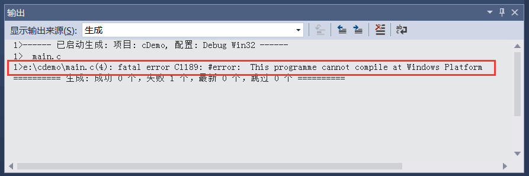
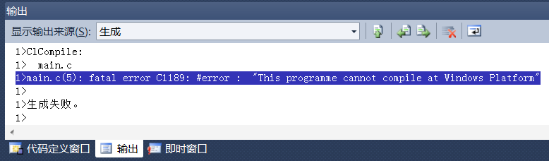

# C语言#error命令，阻止程序编译

\#error 指令用于在编译期间产生错误信息，并阻止程序的编译，其形式如下：

```
#error error_message
```

例如，我们的程序针对 Linux 编写，不保证兼容 Windows，那么可以这样做：

```c
#ifdef WIN32
#error This programme cannot compile at Windows Platform
#endif
```

WIN32 是 Windows 下的预定义宏。当用户在 Windows 下编译该程序时，由于定义了 WIN32 这个宏，所以会执行 `#error `命令，提示用户发生了编译错误，错误信息是：

This programme cannot compile at Windows Platform

这和发生语法错误的效果是一样的，程序编译失败。请看下面的截图：


VS2015 下的错误信息


需要注意的是：报错信息不需要加引号`" "`，如果加上，引号会被一起输出。例如将上面的 #error 命令改为：

```
#error "This programme cannot compile at Windows Platform"
```

那么错误信息如下：


再如，当我们希望以 C++ 的方式来编译程序时，可以这样做：

```c
#ifndef __cplusplus
#error 当前程序必须以C++方式编译
#endif
```

