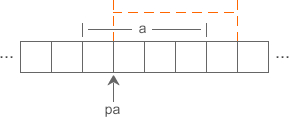
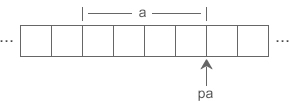

# C语言指针变量的运算（加法、减法和比较运算）

[指针](http://c.biancheng.net/c/80/)变量保存的是地址，而地址本质上是一个整数，所以指针变量可以进行部分运算，例如加法、减法、比较等，请看下面的代码：

```c
#include <stdio.h>
int main(){
    int    a = 10,   *pa = &a, *paa = &a;
    double b = 99.9, *pb = &b;
    char   c = '@',  *pc = &c;
    //最初的值
    printf("&a=%#X, &b=%#X, &c=%#X\n", &a, &b, &c);
    printf("pa=%#X, pb=%#X, pc=%#X\n", pa, pb, pc);
    //加法运算
    pa++; pb++; pc++;
    printf("pa=%#X, pb=%#X, pc=%#X\n", pa, pb, pc);
    //减法运算
    pa -= 2; pb -= 2; pc -= 2;
    printf("pa=%#X, pb=%#X, pc=%#X\n", pa, pb, pc);
    //比较运算
    if(pa == paa){
        printf("%d\n", *paa);
    }else{
        printf("%d\n", *pa);
    }
    return 0;
}
```

运行结果：

```c
&a=0X28FF44, &b=0X28FF30, &c=0X28FF2B
pa=0X28FF44, pb=0X28FF30, pc=0X28FF2B
pa=0X28FF48, pb=0X28FF38, pc=0X28FF2C
pa=0X28FF40, pb=0X28FF28, pc=0X28FF2A
2686784
```

从运算结果可以看出：pa、pb、pc 每次加 1，它们的地址分别增加 4、8、1，正好是 int、double、char 类型的长度；减 2 时，地址分别减少 8、16、2，正好是 int、double、char 类型长度的 2 倍。

这很奇怪，指针变量加减运算的结果跟数据类型的长度有关，而不是简单地加 1 或减 1，这是为什么呢？

以 a 和 pa 为例，a 的类型为 int，占用 4 个字节，pa 是指向 a 的指针，如下图所示：

刚开始的时候，pa 指向 a 的开头，通过 *pa 读取数据时，从 pa 指向的位置向后移动 4 个字节，把这 4 个字节的内容作为要获取的数据，这 4 个字节也正好是变量 a 占用的内存。

如果`pa++;`使得地址加 1 的话，就会变成如下图所示的指向关系：

这个时候 pa 指向整数 a 的中间，*pa 使用的是红色虚线画出的 4 个字节，其中前 3 个是变量 a 的，后面 1 个是其它数据的，把它们“搅和”在一起显然没有实际的意义，取得的数据也会非常怪异。

如果`pa++;`使得地址加 4 的话，正好能够完全跳过整数 a，指向它后面的内存，如下图所示：

我们知道，数组中的所有元素在内存中是连续排列的，如果一个指针指向了数组中的某个元素，那么加 1 就表示指向下一个元素，减 1 就表示指向上一个元素，这样指针的加减运算就具有了现实的意义，我们将在《[C语言数组指针](http://c.biancheng.net/view/1993.html)》一节中深入探讨。

不过C语言并没有规定变量的存储方式，如果连续定义多个变量，它们有可能是挨着的，也有可能是分散的，这取决于变量的类型、编译器的实现以及具体的编译模式，所以对于指向普通变量的指针，我们往往不进行加减运算，虽然编译器并不会报错，但这样做没有意义，因为不知道它后面指向的是什么数据。

下面的例子是一个反面教材，警告读者不要尝试通过指针获取下一个变量的地址：

```c
#include <stdio.h>
int main(){
    int a = 1, b = 2, c = 3;
    int *p = &c;
    int i;
    for(i=0; i<8; i++){
        printf("%d, ", *(p+i) );
    }
    return 0;
}
```

在 VS2010 Debug 模式下的运行结果为：

3, -858993460, -858993460, 2, -858993460, -858993460, 1, -858993460,

可以发现，变量 a、b、c 并不挨着，它们中间还参杂了别的辅助数据。

指针变量除了可以参与加减运算，还可以参与比较运算。当对指针变量进行比较运算时，比较的是指针变量本身的值，也就是数据的地址。如果地址相等，那么两个指针就指向同一份数据，否则就指向不同的数据。

上面的代码（第一个例子）在比较 pa 和 paa 的值时，pa 已经指向了 a 的上一份数据，所以它们不相等。而 a 的上一份数据又不知道是什么，所以会导致 printf() 输出一个没有意义的数，这正好印证了上面的观点，不要对指向普通变量的指针进行加减运算。

另外需要说明的是，不能对指针变量进行乘法、除法、取余等其他运算，除了会发生语法错误，也没有实际的含义。