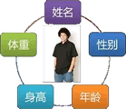

# C语言结构体详解

C语言结构体（Struct)从本质上讲是一种自定义的数据类型，只不过这种数据类型比较复杂，是由 int、char、float 等基本类型组成的。你可以认为结构体是一种聚合类型。

在实际开发中，我们可以将一组类型不同的、但是用来描述同一件事物的变量放到结构体中。例如，在校学生有姓名、年龄、身高、成绩等属性，学了结构体后，我们就不需要再定义多个变量了，将它们都放到结构体中即可。

此外，本章还讲解了与位操作有关的知识点，比如位域、位运算等。